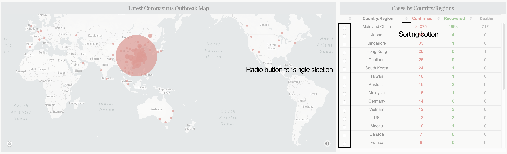
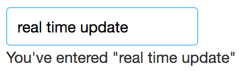
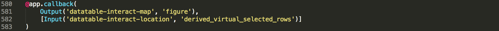
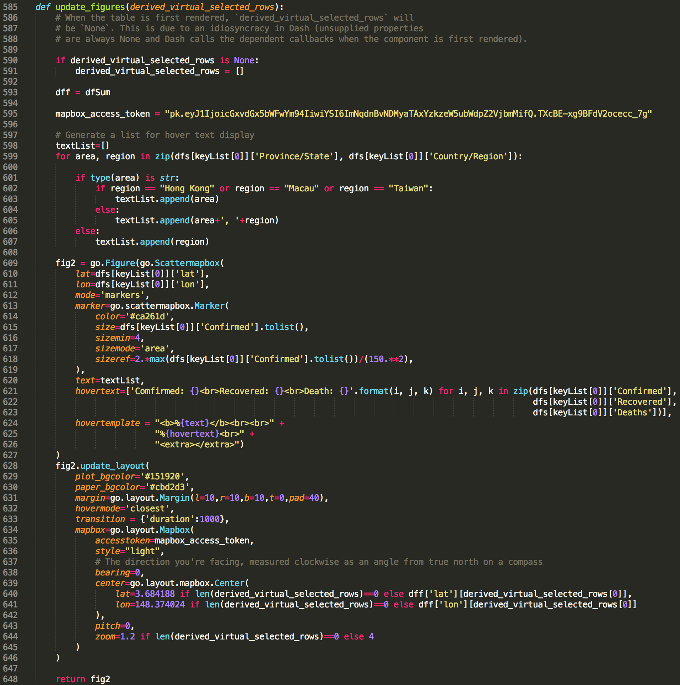

Last week, I shared with you how to make a [dashboard](https://dash-coronavirus-2020.herokuapp.com/) to track the spread of coronavirus using Dash in python, from which you can have a real-time overview of the numbers of global coronavirus cases, including confirmed, recovered and deaths cases, and their distribution on a world map.

As for the first version, we implemented basic dash functions and obtained a static application interface. In other words, except for the native interactions offered by `plotly` (*e.g. hover text display and map exploration on graphs*), all content displayed on screen are set once the application is lunched on user's browser. Users may finish using the dashboard within a couple of seconds and bounce away.

As a web-application in general, a leading indicator of its overall health is engagement rate, which represents the percentage of users who remain active within your application over a defined period of time. This is particularly crucial for commercial web-application that depends on steady user stream to generate revenue (*Of course this is not the purpose of my dashboard application, however, to lead to the topic of this post, let's pretend we are building a "commercial application" for now*). One simple and effective way to increase the engagement rate of a web-application is to elevate its interactivity with user.

As you can see, compared to the first version ([heading figure](https://towardsdatascience.com/build-a-dashboard-to-track-the-spread-of-coronavirus-using-dash-90364f016764) in my last post), a data table is placed next to the map in the latest version of the 2019-nCoV tracking dashboard (Figure 1). Two types of interactivity are added along with this data table,
1. user can sort rows by any one of the four columns (i.e. Country/Region, Confirmed, Recovered, and Deaths);
2. map will update automatically to a zoom-in view of the Country/Region once user select a row in the table (*e.g. when select "Mainland China", map will zoom into China and show cases numbers of each province*).


These two features may help to retain users within the dashboard for a longer time as results displayed on the map can be based on their own interest and selection.

In this post, I will share with you how to achieve aforementioned interactivity using **callbacks** in dash. As usual, you can access all required data and the jupyter notebook from my [Github](https://github.com/Perishleaf/data-visualisation-scripts/blob/master/dash-2019-coronavirus/dashboard-callback-virus.ipynb).

---

### What is callbacks in dash

In dash, a `callback` can be understood as a two-way tunnel linked between python function and the application.

Specifically, two types of cargo, `Input` and `Output`, are delivered inside a `callback` from two directions, `Input` is the cargo delivered from `app` to `function`, which generated via user's actions in the app (*e.g. input a value, select a row, select a item from dropdown menu, hover cursor above a scatter point etc.*). Reversely, `Output` is the cargo from `function` to `app`, which returned by the `function` based on `Input`.

Both `Input` and `Output` have two arguments, `component_id` and `component_property`. `component_id` ensures `callback` to identify right sender and receiver while `component_property` is the entity of cargo. That said, based on these `component_id`, `callback` knows which component should be monitored for its `component_property` as `Inpu`t and to which component should be assigned the `component_property` returned from `function` as `Output`.

In the following example adopted from [Dash tutorial](https://dash.plot.ly/getting-started-part-2), we can see that the two components (*i.e. `dcc.Input()` and `html.Div()`*) within the `html.Div()` container each has an `id`. These two ids have assigned to `Output` and `Input` in the `callback`, respectively. Consequently, value input by user (*`value` property of `dcc.Input` with `id` as 'my-id'*) will be passed to `update_output_div(input_value)` and the returned result will be assigned to `children` property of `html.Div()` with `id` as 'my-div'.

```python
import dash
import dash_core_components as dcc
import dash_html_components as html
from dash.dependencies import Input, Output

external_stylesheets = ['https://codepen.io/chriddyp/pen/bWLwgP.css']

app = dash.Dash(__name__, external_stylesheets=external_stylesheets)

app.layout = html.Div([
    dcc.Input(id='my-id', value='initial value', type='text'),
    html.Div(id='my-div')
])

@app.callback(
    Output(component_id='my-div', component_property='children'),
    [Input(component_id='my-id', component_property='value')]
)
def update_output_div(input_value):
    return 'You\'ve entered "{}"'.format(input_value)

if __name__ == '__main__':
    app.run_server(debug=True)
```
Most importantly, `callback` monitors the `input` cargo traffic in real-time. As in above example, `update_output_div(input_value)` is triggered once there is a change inside the input box and the `children` content updates immediately (Figure 2). This feature enable users to see feedbacks from the application immediately after making an action.


You may notice that the `component_property` is just the property of a given component, which means that we can return any properties of a component via a callback function.

Once we figured out the concept of `callback` in dash, let's dive into the code of my dashboard.

### Callback in this dashboard

Here I first added one more `html.Div()` (**Figure 3, line523-line563**) sub-container inside the container where the map resides. Within this sub-container, there are two components, `html.H5()` for the title and `dash_tale.DataTable()` (**[Dash DataTable](https://dash.plot.ly/datatable) is an interactive table component designed for viewing, editing, and exploring large datasets) for the data table.

Still remember the first type of interactivity, the sorting function? This one is simple, it can be directly set by `sort_action` (**line536, it enables data to be sorted on a per-column basis, which accepts any one value of `none`, `native` and `custom`**) within DataTable component. Here we just used `native`, which sorts data based on their types (**e.g. ascending for number and alphabet for string**).

To be able to select row in the DataTable, we also need to set `row_selectable='single'` (**line534**), the selection UI will then display in front of each row of data.

As for the map component (**i.e, `dcc.graph()`**), you can find that its `id` is ‘datatable-interact-map’ (**line519**) while the DataTable component with an `id` of ‘datatable-interact-location’ (**line529**). These are two ids used in the callback. I like to use meaningful id names which helps to maintain the code in future.

Alright, everything in the app side is ready, now let’s move to the callback part. In our case, as the `Input` cargo, we have `derived_virtual_selected_rows` (**this is not an arbitrary name, it is a list of index of select row for `dash_table.DataTable` component**) from DataTable, the cargo will then deliver to the function to return a `figure` property for `dcc.graph()`.

Thus, as shown in `Figure 4`, we assigned corresponding `id` to `Output` and `Input`, in the meantime, tagged correct property for callback to monitor. Note that Input must be in a list.


Last, let’s finish the function side. The interactivity we want is to let user to select one row from the DataTable, map will then automatically move to and zoom-in the selected Country/Region. In addition, at the start of the application, the initial center point and zoom-level should show the whole world map.

Callback and its function will be called when the application is first time initiated. However, when the application is first rendered, there is no row is selected, hence `derived_virtual_selected_rows` will be `None`. This may cause issue for the function relies on `derived_virtual_selected_rows`. That is why you can see from line590 to line591 (Figure 5), at the beginning of the function, we set `derived_virtual_selected_rows` as an empty list. Once user made a selection, the index of the selected row of the DataTable will be stored inside `derived_virtual_selected_rows`. As we only enabled single selection, it will contain only one item. To access this index, we hence just need to call `derived_virtual_selected_rows[0]`.


By using the `go.layout.mapbox.Center()` (**Figure 5, line639–641**), we can specify coordinates where map should be centered and its zoom-in level. Thus, when the application is first launched and the `derived_virtual_selected_rows` is an empty list, we will use predefined coordinates and zoom-in level. Once there is a selection inside `derived_virtual_selected_rows`, callback will update the map with corresponding coordinates and zoom-in level.

```python
lat=3.684188 if len(derived_virtual_selected_rows)==0 else dff['lat'][derived_virtual_selected_rows[0]]
lon=148.374024 if len(derived_virtual_selected_rows)==0 else dff['lon'][derived_virtual_selected_rows[0]]
zoom=1.2 if len(derived_virtual_selected_rows)==0 else 4
```

Hurray, we now add two types of interactivity for the dashboard using callback. I hope you find this post useful and now have an idea about callback in dash.

Here are lists I used to learn dash callback:

* [Basic dash callbacks](https://dash.plot.ly/getting-started-part-2)
* [Dash gotchas](https://dash.plot.ly/faqs)
* [Dashtable interactivity](https://dash.plot.ly/datatable/interactivity)

---

As always, I welcome feedback, constructive criticism, and hearing about your data science projects. I can be reached on [Linkedin](https://www.linkedin.com/in/jun-ye-29aaa769/), and now on my [website](https://junye0798.com/) as well.