Python is slow.

I bet you might encounter this counterargument many times about using Python, especially from people who come from `C` or `C++` or `Java` world. This is true in many cases, for instance, looping over or sorting Python arrays, lists, or dictionaries can be sometimes slow. After all, Python is developed to make programming fun and easy. Thus, the improvements of Python code in succinctness and readability have to come with a cost of performance.

Having said that, many efforts have been done in recent years to improve Python’s performance. We now can process large datasets in an efficient way by using numpy, scipy, pandas, and [numba](http://numba.pydata.org/), as all these libraries implemented their critical code paths in `C`/`C++`. There is another exciting project, the [Pypy project](https://www.pypy.org/), which speed up Python code by 4.4 times compared to [Cpython](https://stackoverflow.com/questions/17130975/python-vs-cpython/17130986) (original Python implementation).

Other than these external resources, **what can we do to speed up Python code in our daily coding practice?** Today, I will share with you 10 tricks that I used a lot during my Python learning process.

As usual, if you want to rerun codes in this post yourself, all required data and notebook can be accessed from my [Github](https://github.com/Perishleaf/data-visualisation-scripts/tree/master/speed_up_python_code).

#### 1. Familiar with built-in functions

Python comes with many built-in functions implemented in `C`, which are very fast and well maintained (Figure 1). We should at least familiar with these function names and know where to find it (some commonly used computation-related functions are `abs()`, `len()`, `max()`, `min()`, `set()`, `sum()`). Therefore, whenever we need to carry out a simple computation, we can take the right shortcut instead of writing our own version in a clumsy way.
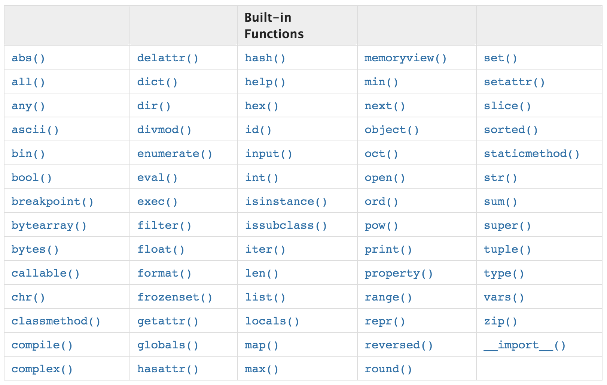

Let’s use the built-in functions `set()` and `sum()` as examples. As you can see in Figure 2, it is 36.1 and 20.9 times faster using `set()` and `sum()` than the functions written by ourselves, respectively.
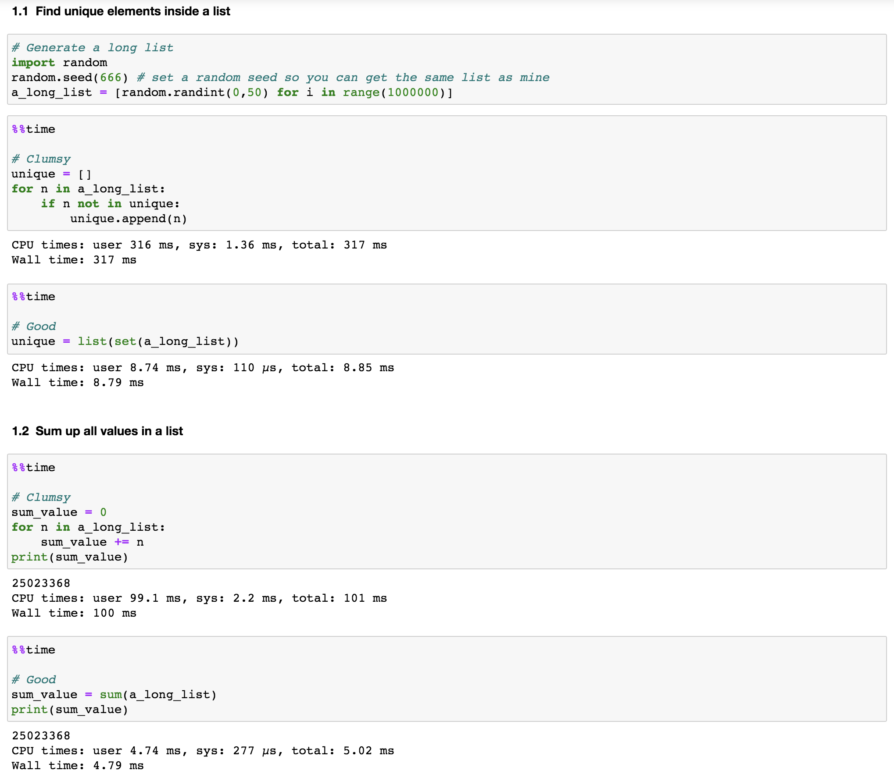

#### 2. `sort()` vs. `sorted()`

Both functions can sort list.

If we just want to obtain a sorted list and do not care about the original list, **`sort()` is a bit faster than `sorted()` both for basic sorting and when using key parameters** (the `key` parameter specifies a function to be called on each list element prior to making comparisons), as shown in Figure 3.

This is because the `sort()` method modifies the list in-place while `sorted(`) builds a new sorted list and keep original list intact. Note that even though we assigned `a_long_list.sort()` to a new variable (`a_long_list_sorted`), the order of values inside `a_long_list` itself actually already changed.
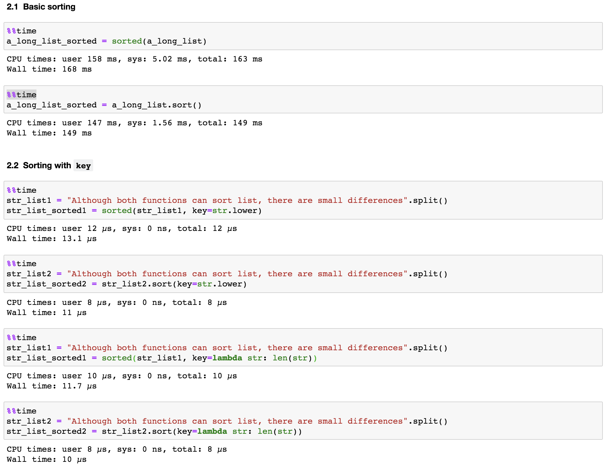

However, `sorted()` is more versatile compared to `sort()`. This is because `sorted()` accepts any iterable while `sort()` is only defined for lists. Therefore, if we want to sort something other than a list, `sorted()` is the right function to use. For example, we can quickly sort a dictionary either by its keys or values (Figure 4).
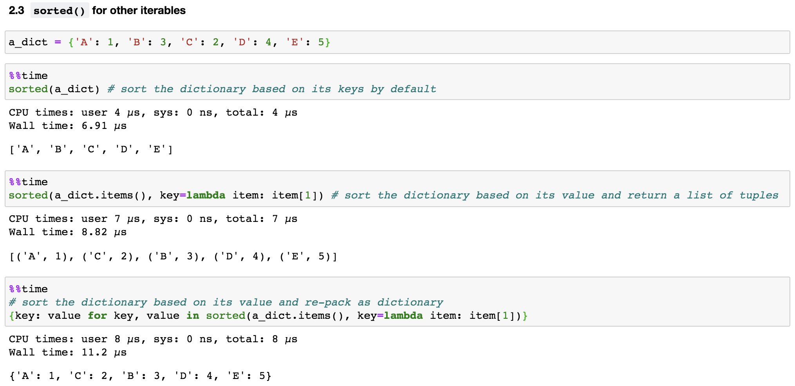

#### 3. Use symbols instead of their names

As shown in Figure 5, when we need an empty dictionary or list object, instead of using `dict()` or `list()`, we can directly call `{}` (as for an empty set, we need to use `set()` itself) and `[]`. This trick may not necessarily speed-up the codes, but do make the codes more [pythonic](https://stackoverflow.com/questions/25011078/what-does-pythonic-mean).
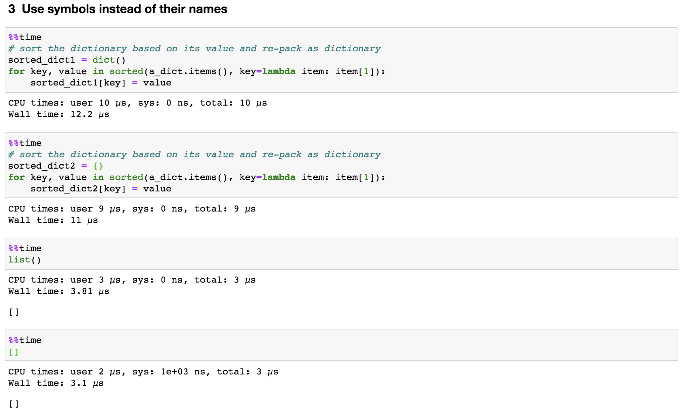

#### 4. List comprehension

Normally when we need to create a new list from an old list based on certain rules, we use a `for` loop to iterate through the old list and transform its values based on the rule and save in a new list. For example, let’s say we want to find all even numbers from `another_long_list`, we can use the following codes:

```python
even_num = []
for number in another_long_list:
    if number % 2 == 0:
        even_num.append(number)
```

However, there is a more concise and elegant way to achieve this. As shown in Figure 6, **we put the original for loop in just a single line of code.** Moreover, the speed improved by almost 2 times.
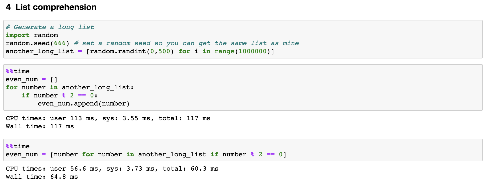

Combined with **rule 3**, we can turn list into dictionaries or sets as well, just change `[]` as `{}`. Let’s rewrite codes in Figure 5, we can omit the step of assignment and complete the iteration inside the symbol, like this 
```python
sorted_dict3 = {key: value for key, value in sorted(a_dict.items(), key=lambda item: item[1])}.
```

To break this down, start at the end. The function “`sorted(a_dict.items(), key=lambda item: item[1])`” returned us a list of tuples (Figure 4). Here, we used multiple assignment to unpack the tuple, as for each tuple inside the list, we assigned `key` to its first item and `value` to its second item (as we know there are two items inside each tuple in this case). Finally, each pair of `key` and `value` was kept inside a dictionary.

#### 5. Use `enumerate()` for value and index

Sometimes, when we iterate through a list, we want to use both its values and indices in expressions. As shown in Figure 7, we should use `enumerate()`, which turns values of a list into pairs of index and value. This also speed-up our code by about 2 times.
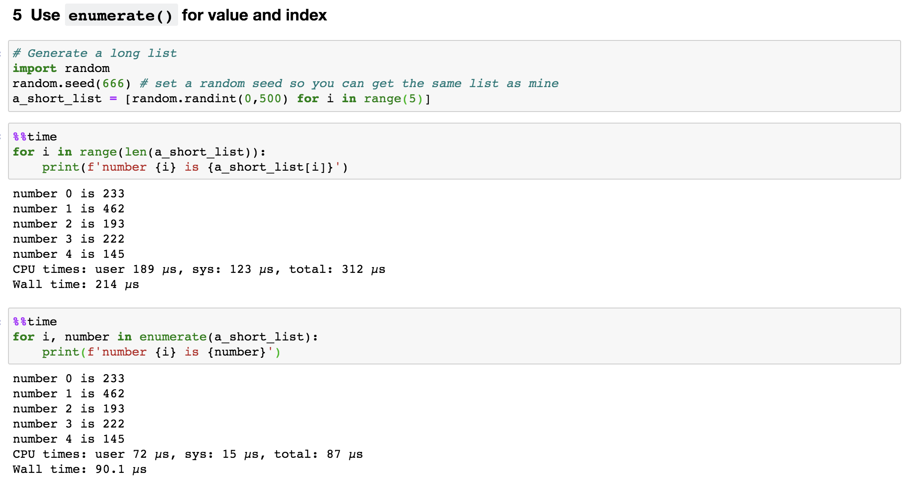

#### 6. Use `zip()` for packing and unpacking multiple iterables

In some cases, we will need to iterate through two or more lists. We then can use `zip()` function, which transforms multiple lists into a single list of tuples (Figure 8). Note that the lists are better to be in the same length, otherwise, `zip()` stops as soon as the shorter list ends.
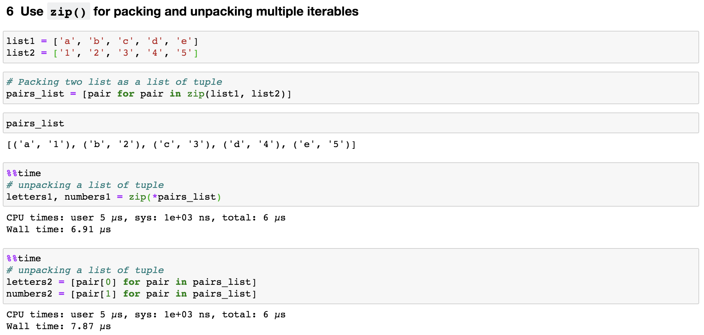

Reversely, to access items in each tuple within the list, we can also unzip a list of tuple by adding an asterisk(\*) and using multiple assignments, like this, `letters1, numbers1 = zip(*pairs_list)`.

#### 7. Combine `set()` and `in`

When we want to check if a value exists inside a list or not, a clumsy way is to construct a function like this:
```python
# Construct a function for membership test
def check_membership(n):
    for element in another_long_list:
        if element == n:
            return True
    return False
```

Then call `check_membership(value)` to see if the `value` inside `another_long_list`. However, a pythonic way to do this is just to use in by calling `value in another_long_list` as shown in Figure 9. It just like you are asking Python literally that “hey python, could you please tell me if `value` inside `another_long_list`”.
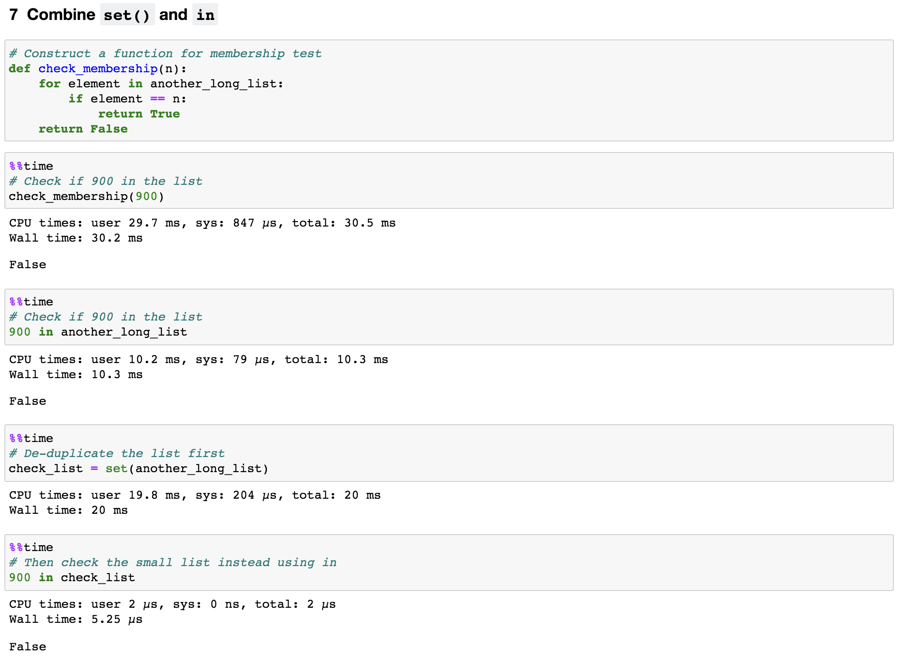

To be more efficient, we should first remove duplicates from the list by using `set()` and then test the membership in the set object. By doing so, we reduced the number of elements that need to be check. In addition, `in` is a very fast operation on sets by design.

As you can see from Figure 9, even though it took 20ms to construct the set object, this is just a one-time invest and the checking step itself only used 5.2µs. That is 1962 times improvement.

#### 8. Check if a variable is true

Inevitably, we will use a lot of `if` statements to check for empty variables, empty lists, empty dictionaries, and so on. We can save a bit time from here as well.

As shown in Figure 10, we do not need to explicitly state `== True` or `is True` in the `if` statement, instead we just use the variable name. This saves the resource used by magic function [`__eq__`](https://stackoverflow.com/questions/3588776/how-is-eq-handled-in-python-and-in-what-order) for comparing values in both sides.
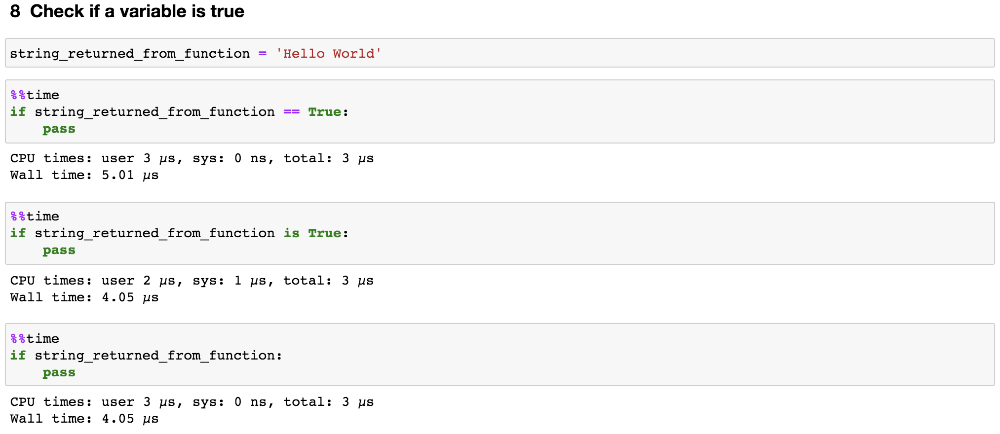

Likewise, if we need to check if the variable is empty, we just need to say `if not string_returned_from_function:`.

#### 9. Count unique values use `Counters()`

Let’s say we are trying to count unique values in the list we generated in **Rule 1**, `a_long_list`. One way is to create a dictionary in which the keys are numbers and the values are counts. As we iterate the list, we can increment its count if it is already in the dictionary and add it to the dictionary if it is not.

```python
num_counts = {}
for num in a_long_list:
    if num in num_counts:
        num_counts[num] += 1
    else:
        num_counts[num] = 1
```

However, a more efficient way to do this is just using `Counter()` from [collections](https://docs.python.org/3.8/library/collections.html) in one line of code, `num_counts2 = Counter(a_long_list)`. Yes, it is that simple. As show in Figure 11, it is about 10 times faster than the function we wrote.

If we want to know the 10 most common numbers, the `Counter()` instance also has a `most_common` method that is very handy.
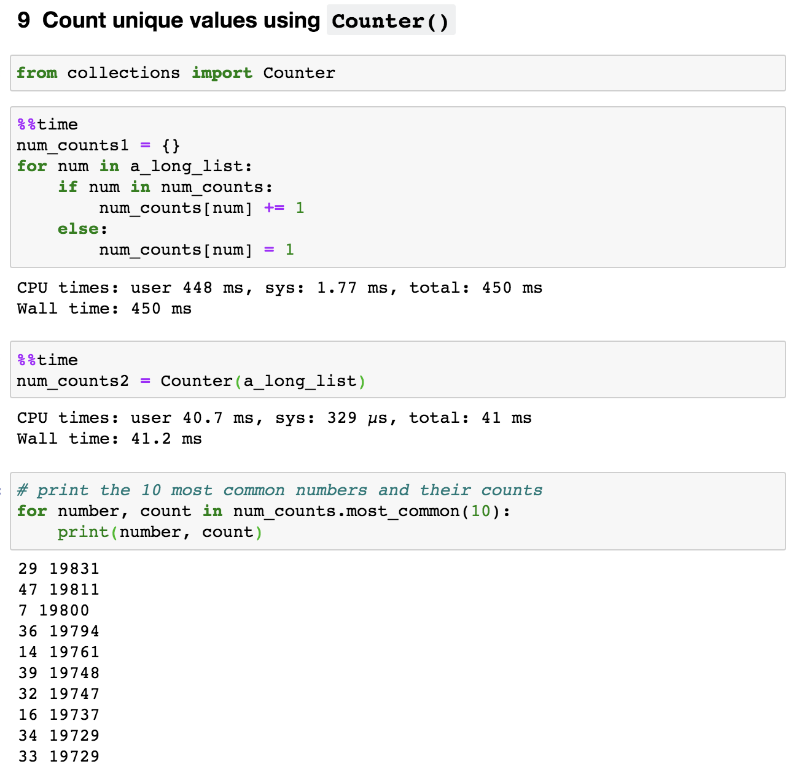

In a word, **collections** is an amazing module, we should save it into our daily tool box and use it whenever we can.

#### 10. Put `for` loop inside the function

There might be a time that we built a function and need to reiterate this function for a given number of times. An obvious way is that we build a function and then put this function into a `for` loop.

However, as shown in Figure 12, instead of repeatedly executing the function 1 million time (the length of a_long_list is 1,000,000), we integrated the `for` loop inside the function. This saved us about 22% of running time.
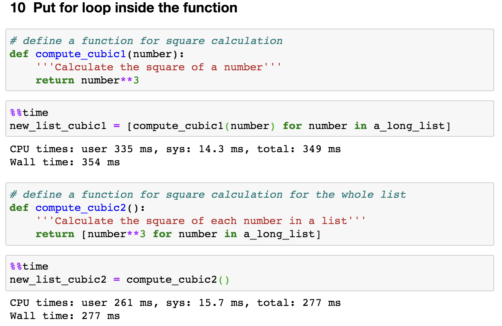

That’s all! Thanks for reading this post. I hope that some tricks can be useful for you. Also, what are some other approaches that you used to speed up your Python code? I will really appreciate if you share them by leaving a comment.

Here are links you may be interested in:

* [How to sort a list using `sort()` and `sorted()`](https://docs.python.org/3/howto/sorting.html)
* [When to use a list comprehension in Python](https://realpython.com/list-comprehension-python/)
* [Transforming Code into Beautiful, Idiomatic Python](https://www.youtube.com/watch?v=OSGv2VnC0go)
* [Advantages and Disadvantages of Python Programming Language](https://medium.com/@mindfiresolutions.usa/advantages-and-disadvantages-of-python-programming-language-fd0b394f2121)

---
As always, I welcome feedback, constructive criticism, and hearing about your data science projects. I can be reached on [Linkedin](https://www.linkedin.com/in/jun-ye-29aaa769/), and now on my [website](https://junye0798.com/) as well.