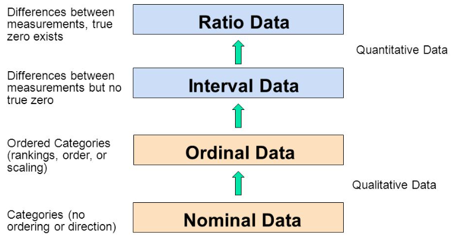
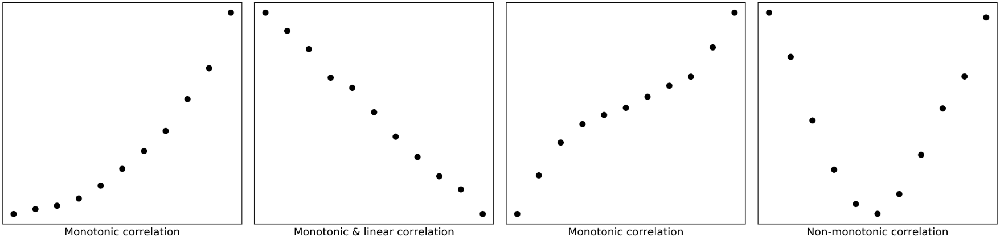
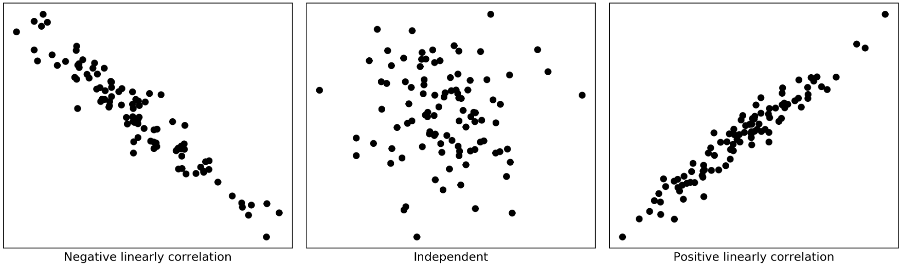
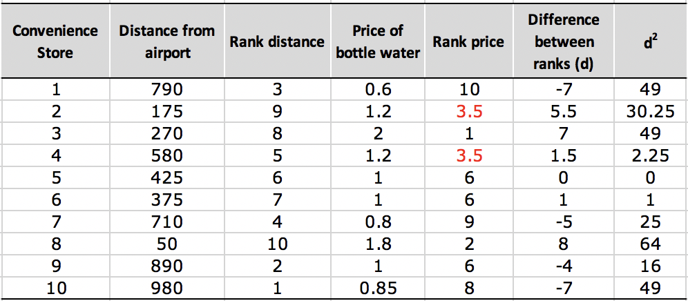

Correlation is one of the most fundamental statistical concepts used in almost any sectors.

For example, as in [portfolio management](https://www.investopedia.com/terms/p/portfoliomanagement.asp), correlation is often used to measure the amount of diversification among the assets contained in a portfolio. Choosing assets with low or negative correlation with each other can help to reduce the risk of a portfolio. In addition, correlations give insights about marketing strategies and business outcomes in [marketing research](https://en.wikipedia.org/wiki/Marketing_research), which further help marketers make actionable decisions, and ultimately, grow businesses.

In a nutshell, we use correlation to state in quantitative terms both the **strength** and **direction** of the relationship between two sets of variables when the measurements in one set are related to those in the other set in a way not expected by chance alone.

Possibly, you might have similar experience like me, struggling with many different types of correlations (e.g. *Pearson, Spearman, Kendall, Biserial, Tetrachoric and many more*). **What are the differences? Which one should we use? and How do we calculate them in Python**?

In this post, I will share with you my notes for answering these questions. As usual, I provide a notebook for you to practice with, which can be accessed from [my Github](https://github.com/Perishleaf/data-visualisation-scripts/tree/master/correlation_explained).

---

#### 1. Several key terms

Before we delve into correlations, it would be better if we can list some key terms and keep them handy.

1. **Standard deviation**: it is a measure of the amount of variation or dispersion of a set of values (*it is just the square root of variance σ²*).
* **Population** Standard Deviation: $N$ is population size and $\mu$ is population mean.

$$ \sigma = \sqrt{\frac{\displaystyle\sum_{i=1}^{N}(x_i - \mu)^2}{N}} $$
**$N$** : population size

**$\mu$** : population mean 

* **Sample** Standard Deviation: $n$ is sample size and $\bar{x}$ is the sample mean.

$$ s = \sqrt{\frac{\displaystyle\sum_{i=1}^{n}(x_i - \bar{x})^2}{n-1}} $$

**$n$** : sample size

**$\bar{x}$** : sample mean of $x$ 

2. **Covariance**: it is a measure of extent of two variables vary in tandem from their mean.

* Population covariance: $N$ is population size and $\mu$ is population mean.

$$ COV(x, y) = \frac{\displaystyle\sum_{i=1}^{N}(x_i - \mu_x)(y_i - \mu_y)}{N} $$

**$N$** : population size

**$\mu_x$** : population mean of $x$

**$\mu_y$** : population mean of $y$

* Sample covariance: $n$ is sample size and $\bar{x}/\bar{y}$ is the sample mean.

$$ COV(x, y) = \frac{\displaystyle\sum_{i=1}^{n}(x_i - \bar{x})(y_i - \bar{y})}{(n - 1)} $$

**$n$** : sample size

**$\bar{x}$** : sample mean of $x$

**$\bar{y}$** : sample mean of $y$

3. **Parametric test**: it assumes underlying statistical distributions in the data. Conditions of validity must be met so that the result of a parametric test is reliable.

4. **Non-parametric test**: it does not rely on any distribution, which can thus be applied when parametric conditions of validity are not met.

5. **Effect size/Strength**: correlation coefficients between .10 and .29 represent a small association, coefficients between .30 and .49 represent a medium association, and coefficients of .50 and above represent a large association or relationship.

6. **Categorical variables**: also known as discrete or qualitative variables. Categorical variables can be further categorised as either **nominal**, **dichotomous** or **ordinal**.

* Nominal variables are variables that have two or more categories, but which do not have an intrinsic order. For example, type of property (house, unit and apartment), company names, religion, colour preference and postal code.

* Dichotomous variables are nominal variables but only have two categories or levels. For example, gender(male and female), yes/no questions, and telecom churn data (churn or stay).

* Ordinal variables are variables that have two or more categories just like nominal variables, but they can also be ordered or ranked. For example, car size(subcompact, compact, midsize, luxury), economic status (lower, middle, or upper class), rank 5 types of beer, and degree of satisfaction (very dissatisfied, somewhat dissatisfied, somewhat dissatisfied, and disatisfied).

7. **Continuous variables**: also known as quantitative variables. This type of data possesses the properties of order and equal intervals between adjacent units. Continuous variables can be further categorised as either interval or ratio variables.

* Interval variables: data that can be measured along a continuum and have numerical values. For example, temperature, birth years, degree of satisfaction (point scale units, 1–10) and shoe size.
* Ratio variables: they are interval variables, but with a clear definition of 0, indicating there is none of that variable. For example, income, price, distance, number of children in a family, hours of driving, dose amount, and many more.

The name “ratio” reflects the fact that multiplication and division operations can be performed on the values of a ratio variable. Thus, we can say that a 15 dollar price is three times more expensive than a 5 dollar price. However, a temperature of 10°C should not be considered twice as hot as 5°C. It is only 5°C higher (i.e. only addition and subtraction operations can be applied to values of an interval variable).

Here is a diagram (Figure 1) adopted from [GraphPad](https://www.graphpad.com/) that may help you to understand these different variables

8. **Monotonic relationship**: in a monotonic relationship, the two variables tend to be one of the following: (1) as the value of one variable increases, so does the value of the other variable; or (2) as the value of one variable increases, the other variable value decreases., but not necessarily at a constant rate (Figure 2).

9. **Linear relationship**: in a linear relationship, the two variables do the same as monotonic relationship but at a constant rate. The trend can be modelled by a straight line. Linear relationships are all monotonic, but not all monotonic relationships are linear.

10. **Tied ranks**: these are two items in a column with the same rank during the calculation for Spearman correlation coefficient.

11. **Concordant/Discordant**: describe if ranks of two samples are ordered in the same way.

Given two observations ($u_i$,$v_i$) and ($u_j$,$v_j$) in a bivariate array, then

$$\frac{v_j-v_i}{u_j-u_i}>0$$ two observations are concordant

$$\frac{v_j-v_i}{u_j-u_i}<0$$ two observations are discordant

$$\frac{v_j-v_i}{u_j-u_i}=0$$ two observations are considered as a tie

when $u_i$ = $u_j$, observations are not compared

$u_i$: the rank of the *ith* observation in the first sample

$v_i$: the rank of the *ith* observation in the second sample

#### 2. Understanding strength, direction and significance of correlation

The correlation between two variables is quantified with a number, **correlation coefficient**, which generally varies between −1 and +1. Zero means there is no correlation, where 1 means a complete or perfect correlation. The strength of the correlation increases both from 0 to +1, and 0 to −1. The sign denotes the direction of the correlation. A negative correlation means that the two variables are inversely correlated.

Generally, in addition to the strength of correlation, we also need to report its statistical significance, the **p-value**. The p-value shows the probability that this strength of correlation may occur by chance. A statistically significant correlation does not necessarily mean that the strength of the correlation is strong.

For example, two correlation coefficients of 0.32 (p<0.01) and 0.93 (p<0.05). Even though correlation of 0.32 has a more significant level (p<0.01), it is still a weaker correlation compered to correlation of 0.93. The p<0.01 only assures that 99% of the time the correlation is 0.32.

#### 3. Pearson’s correlation (parametric test)
Pearson’s correlation coefficient (Pearson product-moment correlation coefficient) is the most widely used statistical measure for the degree of the relationship between **linearly related variables**. It is denoted by letter $r$.

Pearson’s $r$ is calculated via dividing the covariance of these two variables by the product of their standard deviations.
$$ r = \frac{COV(x,y)}{\sigma_x\sigma_y} $$
Its calculation requires the following data assumptions to be valid:
* interval or ratio variables
* linearly related
In practice, the second assumption is visually checked by making a scatterplot with the tested two variables (Figure 3).

> “Pearson r does not assume normality. Many people believe that both variables must be normally distributed in order to justify the computation of > r. But many people also believe that they can drive better after they have been drinking.”
> Albert K. Kurtz & Samuel T. Mayo

Pearson r itself [does not assume normality](https://stats.stackexchange.com/questions/3730/pearsons-or-spearmans-correlation-with-non-normal-data)! In practice, the reason that we still need to check the bivariate normality is for satisfying the assumption underlying the statistical test of significance.

There are several different ways to test normality in Python, including histogram plot (`pyplot.hist()`), Normal Q-Q plot(`statsmodels.qqplot()`), Shapiro-Wilk test (`scipy.stats.shapiro()`), D’Agostino’s test (`scipy.stats.normaltest()`), and Anderson-Darling test(`scipy.stats.anderson()`).

Another thing we need to notice is that, as manifested by the standard deviations in its formula, Pearson’s correlation coefficient is naturally sensitive to skewed distributions and outliers.

If our data meet the above assumptions and prerequisites, we can easily calculate Pearson’s r in Python by calling `scipy.stats.pearsonr(x, y)`, which returns us both Pearson correlation coefficient and p-value. Or we can use `pandas.dataframe.corr(method=’pearson’)` to find the pairwise correlation of all columns in a dataframe.

#### 4. Spearman’s correlation (non-parametric test)
Under most circumstances, if our data meet all requirements, the Pearson’s $r$ is the best measure of relationship and should be used. However, not everything can go on as one wishes. Fortunately, when not ideal data come to our hand, there are still a couple of options enable us to get correlation coefficients.

The Spearman rank correlation coefficient, often denotes as $\rho$ (rho) or $r_s$, is the non-parametric version of the Pearson correlation coefficient. It can deal with ordinal, interval or ratio variables for **monotonic relationships**.

As its name suggests, Spearman’s $\rho$ relies on ranks of the given two variables instead of their values. The formula in its simple form is as follow:

$$ \rho = 1 - \frac{6\displaystyle\sum_{i=1}^{n}d_i^2}{n(n^2-1)} $$ 

**$ n $** : sample size

**$ d_i $** : Difference between ranks for *ith* sample

Please take a look a example in Figure 4 for a calculation of correlation between distance from airport and price of bottled water, which I believe will help you to understand the formula immediately.

As we can see from Figure 4, the Spearman correlation is less sensitive to strong outliers than the Pearson correlation as Spearman’s $\rho$ limits the outlier to the value of its rank.

One other thing should notice is the tied ranks (Store #2 and #4 in Figure 5). When this happens, we can take the average of the ranks that they would have otherwise occupied. It is still ok to use the simple form of formula when the number of ties is small (1 or 2)relative to $n$.
Otherwise we need to use the full version of Spearman’s formula, which will deal with tied ranks:

$$ \rho = \frac{n\displaystyle\sum_{i=1}^{n}u_iv_i-\left(\displaystyle\sum_{i=1}^{n}u_i\right)\left(\displaystyle\sum_{i=1}^{n}v_i\right)}{\sqrt{\left[n\displaystyle\sum_{i=1}^{n}u_i^2-\left(\displaystyle\sum_{i=1}^{n}u_i\right)^2\right]\left[n\displaystyle\sum_{i=1}^{n}v_i^2-\left(\displaystyle\sum_{i=1}^{n}v_i\right)^2\right]}} $$

$u_i$: the rank of the *ith* observation in the first sample

$v_i$: the rank of the *ith* observation in the second sample

In Python, we can call `scipy.stats.spearmanr()`, which return us both $\rho$ and p-value. Or we can use `pandas.dataframe.corr(method=’spearman’)` to find the pairwise correlation of all columns in a dataframe.

#### 5. Kendall’s correlation (non-parametric test)

Generally, when the sample size is small and has many tied ranks, Kendall’s correlation, often denotes as $\tau$ (Tau) (There are three versions of Tau, namely, Tau-a, Tau-b, and Tau-c), is the best alternative to Spearman’s correlation.

Kendall’s correlation requires the same data assumptions as Spearman’s correlation, which 1) ordinal, interval or ratio variables and 2) monotonic relationships between the two variables.

Here we only introduce Tau-b (this is the method used in `scipy.stats.kendalltau(x, y)`), which is defined as:

$$\tau_b=\frac{N_c-N_d}{\sqrt{(N_c+N_d+T_x)(N_c+N_d+T_y)}}$$

where $N_c$ and $N_d$ denoting the number of concordant pairs and the number of discordant pairs, respectively, in the sample. $T_x$ denoting the number of pairs tied for the first response variable only and $T_y$ denoting the number of pairs tied for the second variable only. Kendall's $\tau_b$ is equal to Kendall's $\tau_a$ when there are no ties but is preferred to Kendall's tau-a when there are ties.

In Python, we can call `scipy.stats.kendalltau(x, y)`, which return us both $\tau$ and p-value. Or we can use `pandas.dataframe.corr(method=’kendall’)` to find the pairwise correlation of all columns in a dataframe.

Taken together, in regards to tolerance of outliers and discrepancies in data, Kendall’s correlation is the most robust measure, followed by Spearman’s correlation while Pearson’s correlation is most sensitive one.

#### 6. Point biserial's correlation

When we need to correlate a continuous variable with another **dichotomous variable**, we can use point biserial's correlation.
Point biserial's correlation is usually denoted by symbol $r_{pb}$, calculating as follow:

$$r_{pb}=\frac{M_1-M_0}{s_n}\sqrt{\frac{n_1n_0}{n(n-1)}}$$

$M_1$ being the mean value on the continuous variable X for all data points in group 1, and $M_0$ the mean value on the continuous variable X for all data points in group 2. Further, $n_1$ is the number of data points in group 1, $n_0$ is the number of data points in group 2 and $n$ is the total sample size. 

In Python, this can be calculated by calling `scipy.stats.pointbiserialr(x, y`), which again returns us both a point biserial correlation coefficient and its p-value.

We should notice that there is biserial's correlation, which is also a correlation coefficient for a continuous variable with another dichotomous variable. However, the dichotomous variable here should be fundamentally continuous and normally distributed.

In other words, this type of dichotomous variable, in reality, is continuous and normally distributed, but recorded in only two categories. So can be called as continuous dichotomies.

Compared to **categorical dichotomies**, the **continuous dichotomies** can be thought of as a normally distributed continuous variable that is artificially grouped into two classes. For example, test scores can be split as pass and fail by using a certain threshold. Sales can be classified as bad and good and so on.

However, as you may ask why I want to lose information by converting the continuous variable into a dichotomous variable? To be honest, I don't know either. Maybe statisticians just like to invent formulae. Anyway, in a situation like this, I just use Pearson's correlation.

#### 7. Tetrachoric's correlation

Tetrachoric's correlation is designed to estimate of Pearson $r$ when we wish to correlate two dichotomous variables with each other. Each of these variables may, in reality, be continuous and normally distributed, but recorded in only two categories.

As its definition appears, the applicability of Tetrachoric's correlation is not quite so general. Essentially, it does not apply to categorical variables at all. For such situations, we should use Phi's correlation ($\phi$, AKA. Matthews correlation coefficient (MCC)) instead.

In python, we can get $\phi$ using `sklearn.metrics.matthews_corrcoef()`.

---

Finally, we should notice that there are many more techniques used for correlation calculation, which are not covered in this post. We should definitely to choose appropriate method based on our data and purpose. I hope you learn something useful from this post.

Thanks for reading!

---

Here are some links you may find useful:

* [Nominal, Ordinal, Interval & Ratio Variable + [Examples]](https://www.formpl.us/blog/nominal-ordinal-interval-ratio-variable-example)
* [What is Interval Data? + [Examples, Variables & Analysis]](https://www.formpl.us/blog/interval-data)
* [Measurement scales for nominal, ordinal, interval and ratio variables](http://users.monash.edu/~smarkham/resources/scaling.htm#nominal)
* [Kendall's Tau (Kendall Rank Correlation Coefficient)](https://www.statisticshowto.datasciencecentral.com/kendalls-tau/)
* [Point-Biserial and Biserial Correlations](https://ncss-wpengine.netdna-ssl.com/wp-content/themes/ncss/pdf/Procedures/NCSS/Point-Biserial_and_Biserial_Correlations.pdf)
* [Relationship between the phi, Matthews and Pearson correlation coefficients](https://stats.stackexchange.com/questions/59343/relationship-between-the-phi-matthews-and-pearson-correlation-coefficients)

---
As always, I welcome feedback, constructive criticism, and hearing about your data science projects. I can be reached on [Linkedin](https://www.linkedin.com/in/jun-ye-29aaa769/), and now on my [website](https://junye0798.com/) as well.