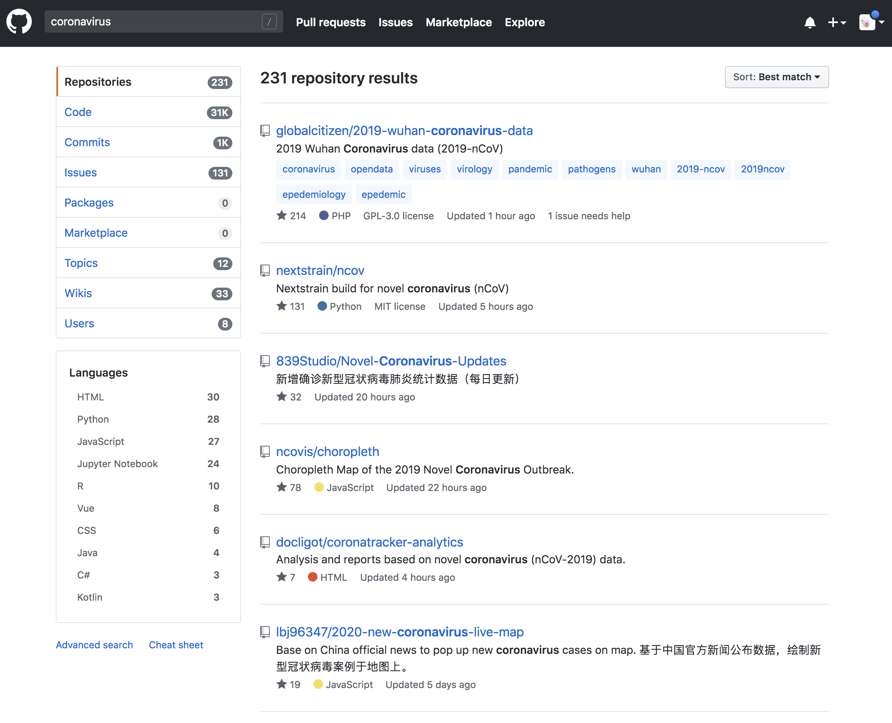
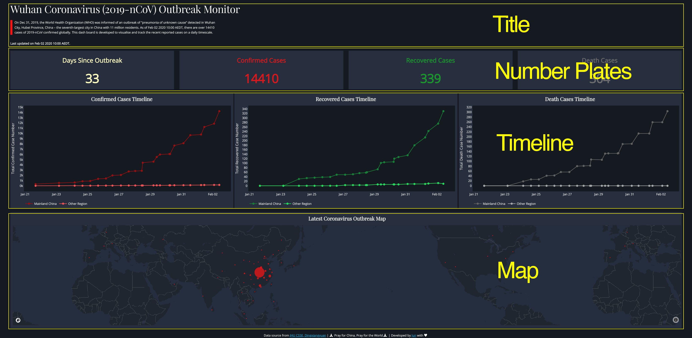
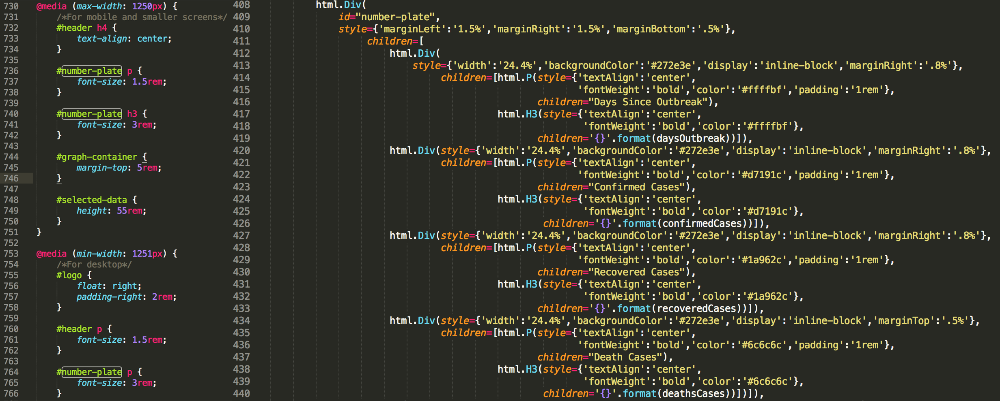
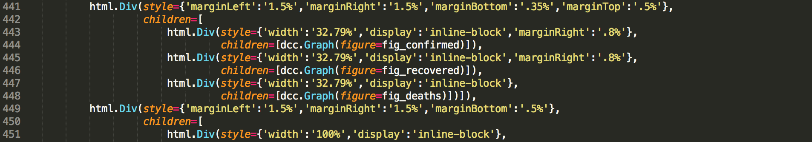
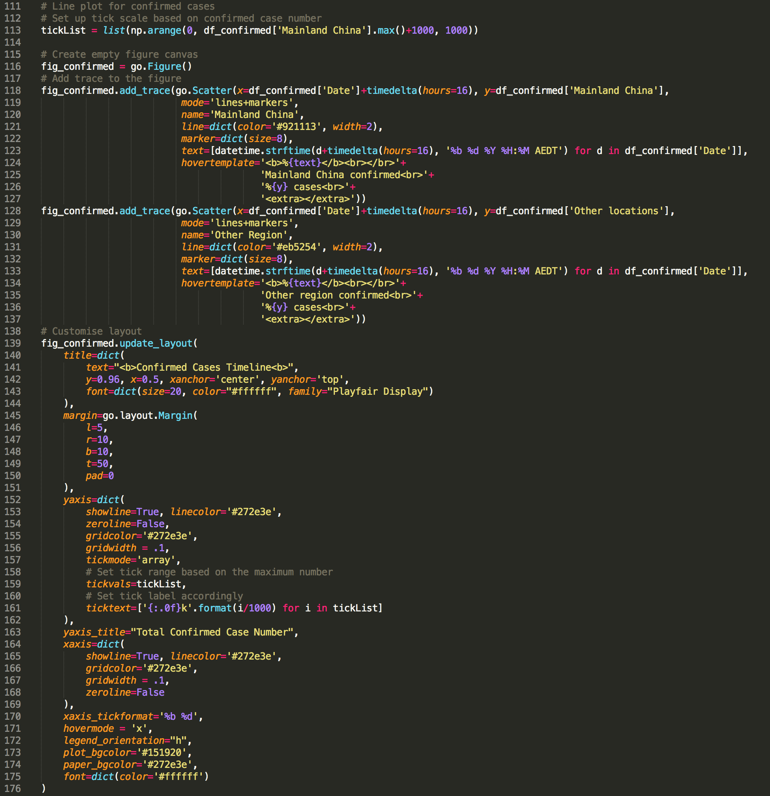

Last month, I published four posts to share with you my experience in using `matplotlib`. Benefit from its full control of elements on a given [graph](https://towardsdatascience.com/create-an-infographic-using-matplotlib-3fbb546c1628), `matplotlib` is deemed as a fundamental python library for data visualisation and used by many other libraries (e.g. `seaborn` and `pandas`) as plotting module. This is also why I think learning `matplotlib` is an essential part for being a practitioner in data science, which helps to build up in-depth understanding about logic behind data visualisation tools.

Nevertheless, great flexibility comes with [convoluted layers](https://towardsdatascience.com/plt-xxx-or-ax-xxx-that-is-the-question-in-matplotlib-8580acf42f44) and [complex syntax](https://towardsdatascience.com/the-many-ways-to-call-axes-in-matplotlib-2667a7b06e06). It can often be daunting with tedious coding to make a publishable plot using `matplotlib`. In other words, `matplotlib` should not be our only data visualisation tool, we need always be equipped with alternatives in our toolbox to handle evolving requirements.

When it comes with requirements for efficiency, interaction, and web-based visualisation, [`plotly`](https://plot.ly/graphing-libraries/) and [`dash`](https://dash.plot.ly/introduction) are must-learn tools. The beauty about these tools is that we do not need to master JavaScript for making interactive web visualisation as both tools handle that for us. They connect us with JavaScript (e.g. React.js, Plotly.js, and d3.js) to make graphs responsive and also beautiful. What we need to provide is just simple codes in pure python environment.

In this post, I will dissect the codes of a dashboard, which I built to track the spread of recent outbreak coronavirus (2019-nCoV). [From this dashboard](https://dash-coronavirus-2020.herokuapp.com/), you can have a real-time overview of the numbers of global coronavirus cases, including confirmed, recovered and deaths cases, and their distribution on a world map.

As usual, you can access all required data and the jupyter notebook from [my Github](https://github.com/Perishleaf/data-visualisation-scripts/tree/master/dash-2019-coronavirus). Since it is still under active development, the version used in this post may differ from what you downloaded. In addition, please feel free to provide your suggestions or help to make this dashboard more useful and accurate.

---

> A dashboard is a visual display of the most important information needed to achieve one or more objectives; consolidated and arranged on a single screen so the information can be monitored at a glance 
>
> -Stephen Few

### Framework
To help you understand the codes (you can find the codes from app.py) quickly, let me first declare the logic behind them. Generally, the framework (i.e. my thinking process) in building this dashboard application via `dash` followed: **Data preparation** -> **Dashboard layout determination** -> **Content generation and insertion**, despite that you may find the third part happened before the second part in the code. That is the way Python read the codes, not us. Bear this framework in mind and let’s dive into these codes.

### Data collection and cleansing
Many sources provide real-time data for tracking the spread of coronavirus (e.g. search “coronavirus” on github, there are 231 repositories, Figure 1). As for my dashboard, I complied data from two sources (i.e. [Johns Hopkins CSSE](https://docs.google.com/spreadsheets/d/1yZv9w9zRKwrGTaR-YzmAqMefw4wMlaXocejdxZaTs6w/htmlview?usp=sharing&sle=true#) and [DingXiangYuan](https://ncov.dxy.cn/ncovh5/view/pneumonia?scene=2&clicktime=1579582238&enterid=1579582238&from=singlemessage&isappinstalled=0)), where they maintained timely and accurate case numbers for this public emergency. Since the codes of this part are pretty straightforward, I only give brief explanations about the key points here.


First, at this stage, I manually downloaded and checked data from these two sources and stored them in Excel data sheets on a daily basis. As the emergency is going on, the number of sheets in the Excel file is increasing as well. I used `pandas.ExcelFile()` function (you need install `xlrd` library to use this function) to import sheets as separated dataframes and store them in a dictionary object (i.e. `dfs`). I therefore can access data from any given date by using key (i.e. `keyList`) of the dictionary.

```python
# Import xlsx file and store each sheet in to a df list
xl_file = pd.ExcelFile('./data.xlsx',)

dfs = {sheet_name: xl_file.parse(sheet_name) 
          for sheet_name in xl_file.sheet_names}

# Data from each sheet can be accessed via key
keyList = list(dfs.keys())

# Data cleansing
for key, df in dfs.items():
    dfs[key].loc[:,'Confirmed'].fillna(value=0, inplace=True)
    dfs[key].loc[:,'Deaths'].fillna(value=0, inplace=True)
    dfs[key].loc[:,'Recovered'].fillna(value=0, inplace=True)
    dfs[key]=dfs[key].astype({'Confirmed':'int64', 'Deaths':'int64', 'Recovered':'int64'})
    # Change as China for coordinate search
    dfs[key]=dfs[key].replace({'Country/Region':'Mainland China'}, 'China')
    dfs[key]=dfs[key].replace({'Province/State':'Queensland'}, 'Brisbane')
    dfs[key]=dfs[key].replace({'Province/State':'New South Wales'}, 'Sydney')
    dfs[key]=dfs[key].replace({'Province/State':'Victoria'}, 'Melbourne')
    dfs[key]=dfs[key].replace({'Province/State':'South Australia'}, 'Adelaide')
    # Add a zero to the date so can be convert by datetime.strptime as 0-padded date
    dfs[key]['Last Update'] = '0' + dfs[key]['Last Update']
    dfs[key]['Date_last_updated'] = [datetime.strptime(d, '%m/%d/%Y %H:%M') for d in dfs[key]['Last Update']]
```

Second, as we are going to make a scatter map to show the distribution of coronavirus cases on a global map, every location should be assigned with coordinates. Here I used service provided by [OpenCageGeocode](https://opencagedata.com/) to call coordinates. As the usage limits (i.e. 2500 API requests per day), it is not feasible to call coordinates for every locations in every sheets repeatedly. We just need to call coordinates for data from the latest date (i.e. `dfs[keyList[0]]`) and plot the latest data on the map.

```python
# Add coordinates for each area in the list for the latest table sheet
# As there are limit for free account, we only call coordinates for the latest table sheet
from opencage.geocoder import OpenCageGeocode
key = 'Your key number'  # get api key from:  https://opencagedata.com
geocoder = OpenCageGeocode(key)

list_lat = []   # create empty lists
list_long = []    
for index, row in dfs[keyList[0]].iterrows(): # iterate over rows in dataframe
    City = row['Province/State']
    State = row['Country/Region']

    if City:
        if City == 'Macau' or City == 'Hong Kong':
            query = str(City)+','+'China'
            results = geocoder.geocode(query)   
            lat = results[0]['geometry']['lat']
            long = results[0]['geometry']['lng']

            list_lat.append(lat)
            list_long.append(long)
        else:
            query = str(City)+','+str(State)
            results = geocoder.geocode(query)   
            lat = results[0]['geometry']['lat']
            long = results[0]['geometry']['lng']

            list_lat.append(lat)
            list_long.append(long)

    else:
        query = str(State)
        results = geocoder.geocode(query)   
        lat = results[0]['geometry']['lat']
        long = results[0]['geometry']['lng']

        list_lat.append(lat)
        list_long.append(long)
# create new columns from lists    
dfs[keyList[0]]['lat'] = list_lat   
dfs[keyList[0]]['lon'] = list_long

dfs[keyList[0]].to_csv("{}_data.csv".format(keyList[0]), index=False)
```

### Dashboard components and layout
Since it is a web-based application, it is inevitable to deal with HTML structures for the layout. Don’t panic, instead of writing HTML ourselves, `dash` provides us the `dash-html-components` library to deal with it. We basically just need to compose the layout using Python structures. Note that the layout can be very complex by combining with a `css` file, however, we will stick with basic layout in this dashboard.

First, we need to understand `html.Div()`. You can consider it as a **container/section** for your content. As shown in Figure 2, there are four containers (actually should be five, including the footnote) in the dashboard. Specifically, in the title container, it has a title (i.e. `html.H4()`) and two paragraphs (i.e. `html.P()`). As for the Number Plates container, it has four sub containers (i.e. `html.Div()`), each sub container is comprised of one paragraph (i.e. `html.P()`) and one title (i.e. `html.H3()`). Simple, right? I believe you can now figure out the remaining containers in the code.


There are three arguments inside `html.Div(id, style={}, children=[])`, where `id` is optional if you do not want to use `css` file (A `css` file is a cascading style sheet file used to format the contents of a webpage) to style the children content. In a simple word, normally, within your application folder (i.e. `dash-2019-coronavirus` folder in our case), there will be a `assets` folder, in which it contains the `css` file to specify the format of the application. You specify a style (e.g. margin, font, and color etc.) and `id` within the `css` file, if you want to use this style in the application layout, instead of adding `style={}` within `html.Div()` repeatedly every time when you want to use the same style, you just need to assign the same `id` within the `html.Div()`. So dash knows how to style its children content within this `html.Div()` container using corresponding style in the `css` file within the `assets` folder.

For example, as you can see from Figure 3, I specified an `id=”number-plate”` in the `html.Div()` container (line 409, right panel), and correspondingly, in line 736, 740, and 764 of the `css` file (left panel), I set up different font sizes for content associated with this `id` when displayed in different screen size (e.g. desktop or ipad). Hence, when user open the application from a small screen, dash knows to use 1.5rem for font in the `html.P()` element and 3rem for font in the `html.H3()` (‘rem’ is the unit set up relative to the root em, to not put you to sleep, let’s skip this in this post for now). Except for this one, I styled the components mostly in the python codes as you can find `style={}` in every container.


Last thing we need to know is that, **in each `html.Div()` container, its children elements fill up empty space in that container following the order from left to right and from top to bottom**. For example, in the Number Plates container (Figure 2), the widths of current four number plates are set up as 24.4% the full width of the screen (i.e. `style={‘width’:‘24.4%’}`, Figure 3, left panel, line 413, 420, 427 and 434), respectively. They thus filled up all empty space in one row from left to right first. Let’s say now you have a fifth number plate with the same width, it will automatically placed at the beginning of a second row in the same container.

>To be a functional house, once we finish its construction, the next thing is to move furnitures into the house.

### Content generation and insertion
As you can see from Figure 4, we constructed sub-containers for graph components (i.e. three scatter-line plots and map). Each sub-container has an children component named as `dcc.Graph()`. This function comes from `dash_core_components` library that can be used to render any plotly-powered data visualisation, passed as the `figure` argument. In other words, we make nice graph using `plotly` and pass it to `dcc.Graph()` and `dash` knows how to deal with the graph , that’s it.


If you are familiar with the syntax logic behind `matplotlib`, you will find the syntax of `plotly` graph object is easy to understand as well (Figure 5). They basically follow the same logic. We first instantiate a empty canvas by calling `fig = go.Figure()`. Then add trace (similar to the concept of `axes` in `matplotlib`). In `plotly`, we have access to customise almost all elements in the graph via `figure.update_layout()`.


### Running application and Deployment in heroku
To run the application locally, just type `python app.py` within the folder that contains all other required files (i.e. assets/, data.xlsx, etc.). Copy and paste the http site to your preferred browser, you will see the application if everything is going right.

```bash
Running on http://127.0.0.1:8050/
Debugger PIN: 707-347-654
 * Serving Flask app "app" (lazy loading)
 * Environment: production
   WARNING: This is a development server. Do not use it in a production deployment.
   Use a production WSGI server instead.
 * Debug mode: on
```

Instead, if you want to share your application publicly, we need to deploy it on a server. I personally found heroku is a very user-friendly option and provides [step-by-step tutorial](https://devcenter.heroku.com/articles/getting-started-with-python) and dash also provide [tutorial](https://dash.plot.ly/deployment) for deployment in heroku. One thing note that I used `conda create` to create a virtual environment for my application instead of using `virtualenv` as indicated in `dash` tutorial.

And, here are some links and posts I found useful while learning how to build this Dash app:

* [Dash website](https://plot.ly/dash/)
* [Heroku tutorial](https://devcenter.heroku.com/articles/getting-started-with-python#deploy-the-app)
* [Dash Plotly Map](https://radumas.info/blog/tutorial/2017/08/10/codeday.html)
* [Finding Bigfoot with Dash](https://timothyrenner.github.io/datascience/2017/08/08/finding-bigfoot-with-dash-part-1.html)
* [Using Plotly’s Dash to deliver public sector decision support dashboards](https://medium.com/a-r-g-o/using-plotlys-dash-to-deliver-public-sector-decision-support-dashboards-ac863fa829fb)

---

As always, I welcome feedback, constructive criticism, and hearing about your data science projects. I can be reached on [Linkedin](https://www.linkedin.com/in/jun-ye-29aaa769/), and now on my [website](https://junye0798.com/) as well.