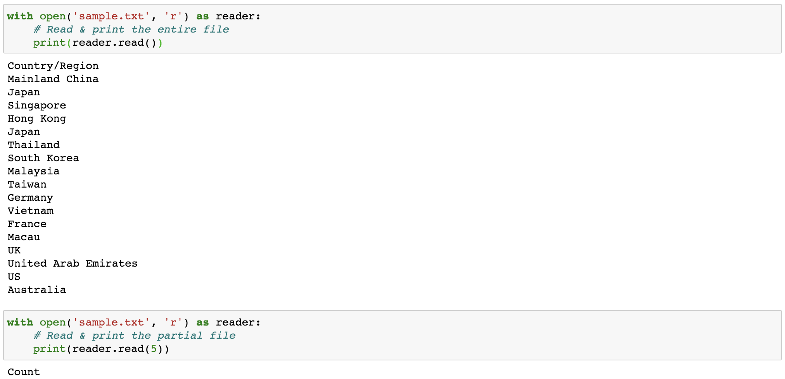
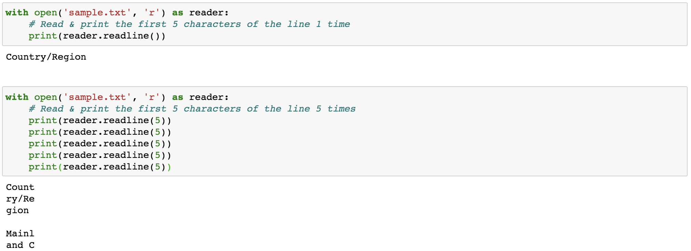
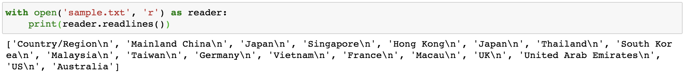
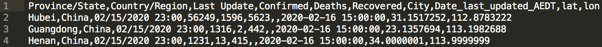
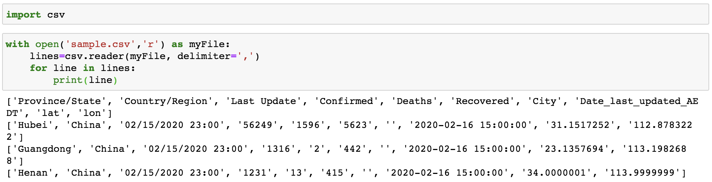
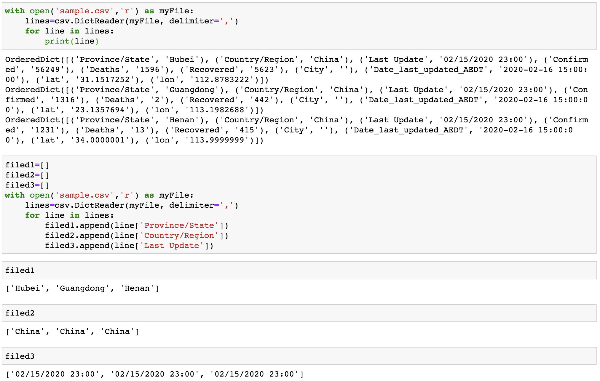
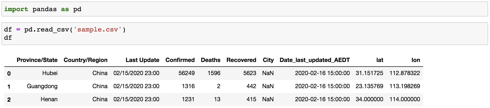
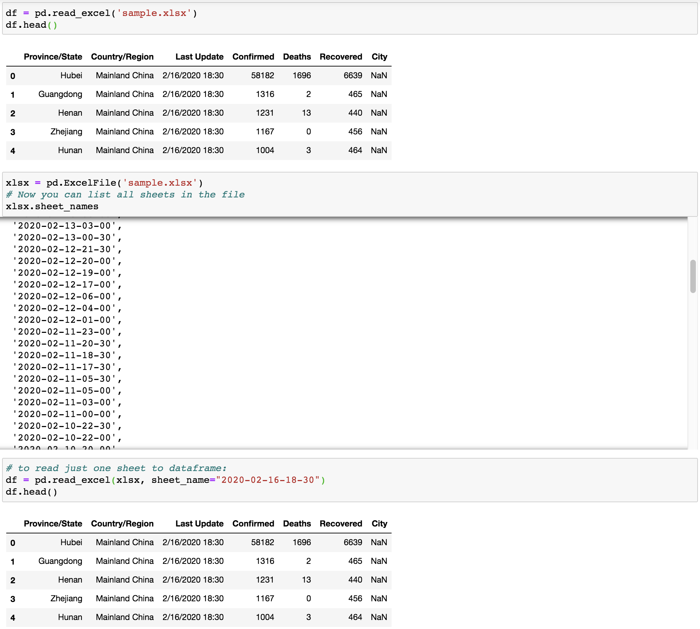
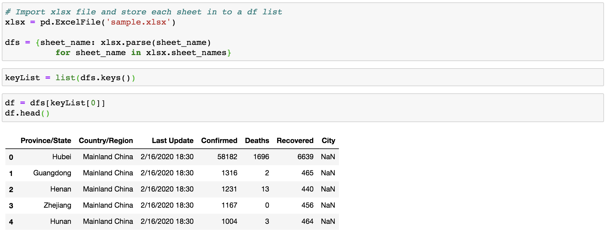

The prerequisite for doing any data-related operations in Python, such as data cleansing, data aggregation, data transformation, and data visualisation, is to load data into Python. Depends on the types of data files (e.g. `.csv`, `.txt`, `.tsv`, `.html`, `.json`, Excel spreadsheets, relational databases etc.) and their size, different methods should be applied to deal with this initial operation accordingly. In this post, I will list some common methods for importing data in Python.

As usual, all required data and notebook can be accessed from [my Github](https://github.com/Perishleaf/data-visualisation-scripts/tree/master/data_import_python).

---

#### 1. Python build-in functions (`read()`, `readline()`, and `readlines()`)

In general, a text file (`.txt`) is the most common file we will deal with. Text files are structured as a sequence of lines, where each line includes a sequence of characters. Let’s assume we need to import in Python the following text file (`sample.txt`).

```bash
Country/Region
Mainland China
Japan
Singapore
Hong Kong
Japan
Thailand
South Korea
Malaysia
Taiwan
Germany
Vietnam
France
Macau
UK
United Arab Emirates
US
Australia
```

To import its content to Python, we need to first open it. This step is just like double-clicking a file to open it in our computer system. However, in Python, this is done by calling the `open()` built-in function. `open()` has a required argument that is the path to the file and an optional argument to indicate the mode (i.e. default argument ‘r’: open for reading; ‘w’: open for writing). With those set, `open()` then returns us a file object.

There are three methods to read content (i.e. `read()`, `readline()`, and `readlines()`) that can be called on this file object either by one or in combination.

* `read(size=-1)`: this reads from the file based on the number of `size` bytes. If no argument is passed or `None` or `-1` is passed, then the entire file is read.

* `readline(size=-1)`: this reads the entire line if no arguments are passed or `None` or `-1` is passed (Figure 2 upper panel). Or if passed with `siz`e, this reads the `size` number of characters from the line. Moreover, multiple `readline()` functions (Figure 2 lower panel) can be called sequentially, in which the next `readline()` function will continue from the end position of last `readline()` function. Note that output of the third `readline()` appends an extra newline character(`\n`, displayed as a new line). This can be avoided by using `print(reader.readline(5), end=’’)`.


* `readlines()`: this reads all the lines or remaining lines from the file object and returns them as a list (Figure 3).


You might notice that all the above codes have `with` statements. The `with` statement provides a way for ensuring that the file is always closed after open. Without the `wit`h statement, we need explicitly to call `close()` for the file object. For instance:
```python
file = open("sample.txt")
data = file.read()
print(data)
file.close()
```

As it is very easy to forget to close the file, we should always use `with` statement. This also provides better syntax and exceptions handling.

#### 2. Python `csv` library

The `sample.txt` we just processed had only one field per line, which make it handy to process using just build-in function (`read()`, `readline()`, and `readlines()`). However, more frequently we will work with a file that has multiple fields on each line (aka **tabular data**), as shown in Figure 4.


As we can see that every filed on each line is comma-separated, indicating where one field ends and the next field starts. We call this type of file the **delimited file**. These files are often either comma-separated (`.csv`)or tab-separated (`.tsv` or `.txt`). In rare cases, you may also encounter other delimiters like colon (`:`), semi-colon (`;`), and characters.

Even though the build-in function can still process these files, it is highly likely to mess up, especially when there are hundreds of fileds per line in some cases. Alternatively, we can use [Python’s `csv` library](https://docs.python.org/3/library/csv.html) designed to read delimited files. Here let’s learn two common functions from this module.

* `csv.reader()`: this reads all lines in the given file and returns a reader object. Then each line can be returned as a list of strings.


* `csv.DictReader()`: if the file has headers (normally the first row that identifies each filed of data), this function reads each line as a dict with the headers as `keys` (Figure 6, upper panel). We then can access data of each column by calling its fieldname (Figure 6, lower panel)


#### 3. Import data using Pandas

Another very popular option in importing data in Python must go to [**Pandas**](https://pandas.pydata.org/getting_started.html), especially when the data size is big (like several hundred MBs). We won’t delve into the specifics of how `pandas` works or how to use it. There are many excellent [tutorials](https://www.datacamp.com/community/tutorials/pandas-read-csv) and books (e.g. [Python for Data Analysis](https://www.amazon.com/gp/product/1491957662/ref=as_li_qf_asin_il_tl?ie=UTF8&tag=quantpytho-20&creative=9325&linkCode=as2&creativeASIN=1491957662&linkId=ea8de4253cce96046e8ab0383ac71b33), by [Wes McKinney](https://wesmckinney.com/), creator of pandas). Here we just show some of the power of `pandas` in reading `csv` and `excel` files.

* `pd.read_csv()`: this reads a `csv` file into `DataFrame` object. An important point here is that `pandas` is smart enough to automatically tell the header row and data type of each field, which make the downstream analyse more efficient.


* `pd.read_excel(`): this reads an excel file (`.xls`, `.xlsx`, `.xlsm`, `.xlsb`, and `.odf` file extensions) into a pandas `DataFrame`. By default, it only import the first data sheet within the excel file (`sample.xlsx` has multiple sheets), as shown in Figure 8.


To be able to access a specific sheet within the excel file, we can first import the whole excel file using `pd.ExcelFile()` and then specify the sheet name when calling `pd.read_excel()` (Figure 8).

Moreover, to be handier in accessing all sheets, instead of calling `pd.read_excel()` multiple times, we can store all sheets as `dataframe` objects inside a `dict` (Figure 9). A practical example can also be found in this [post](https://towardsdatascience.com/build-a-dashboard-to-track-the-spread-of-coronavirus-using-dash-90364f016764).


#### 4. Options for importing large size data

In the age of big data, sometimes, we need to import files from a client or colleague, which may be too large (gigabytes or terabytes) to load into memory. So what should we do to tackle this bottleneck?

Fortunately, Pandas provides `chunksize` option to work this around. Essentially, we are not importing the whole file in one go instead of importing partial contents.

In addition, I found a very useful [post](https://medium.com/casual-inference/the-most-time-efficient-ways-to-import-csv-data-in-python-cc159b44063d) by Mihail Yanchev, where he provided multiple methods and compared their efficiency in handling this situation. Here I just list those methods mentioned in his post and you can read his post if that is what you are looking for.

* [dask.dataframe()](https://docs.dask.org/en/latest/dataframe.html): a large parallel DataFrame composed of many smaller Pandas DataFrames, split along the index. A good thing is that most functions used with pandas can also be used with dask.

* [datatable](https://github.com/h2oai/datatable): a Python package for manipulating big 2-dimensional tabular data structures (aka data frames, up to 100GB).

---

Alright, now we know the basics of importing data in Python. Of course, there are many other cases in importing data in Python that I cannot list them all here, like parsing `html` using [BeautifulSoup](https://www.crummy.com/software/BeautifulSoup/bs4/doc/) and reading sql table using `pd.read_sql_query()`. I hope this post gets you to start from the ground and up to explore more possibilities.

Here are links you may be interested in:

* [Importing data in Python cheat sheet](https://www.datacamp.com/community/blog/importing-data-python-cheat-sheet)
* [Reading and Writing Files in Python (Guide)](https://realpython.com/read-write-files-python/)
* [Reading and Writing csv file in Python](https://realpython.com/python-csv/)
* [Reading and Writing json data in Python](https://realpython.com/python-json/)
* [Using chunksize in Pandas](http://acepor.github.io/2017/08/03/using-chunksize/)
* [How to import various data using Pandas](https://www.listendata.com/2017/02/import-data-in-python.html)
* [An Overview of Python’s Datatable package](https://towardsdatascience.com/an-overview-of-pythons-datatable-package-5d3a97394ee9)

---

As always, I welcome feedback, constructive criticism, and hearing about your data science projects. I can be reached on [Linkedin](https://www.linkedin.com/in/jun-ye-29aaa769/), and now on my [website](https://junye0798.com/) as well.