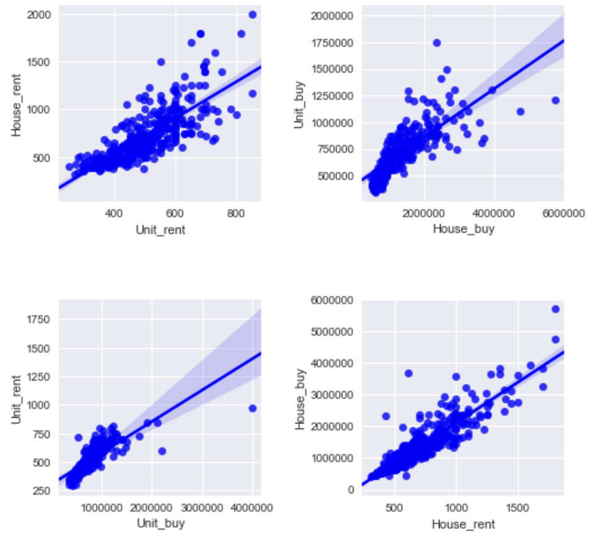
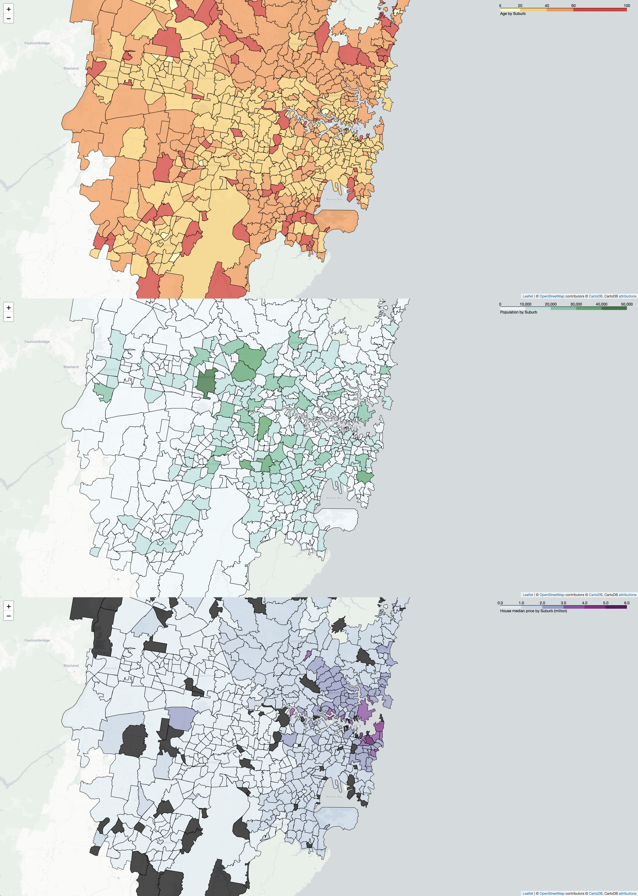

---
authors:
- admin
categories:
- Post
date: "2019-12-15T00:00:00Z"
draft: false
featured: ture
image:
  caption: ''
  focal_point: ""
  placement: 2
  preview_only: false
lastmod: "2019-12-15T00:00:00Z"
projects: []
subtitle: 'The magic of data science with Python'
summary: 
tags:
- Web Crawling
- Folium
- Data imputation
- Foursquare solutions
- K mean Clustering
title: 'Exploring Sydney Suburbs for Opening A New Restaurant'
---

I have been studying the [IBM Data Science course](https://www.coursera.org/professional-certificates/ibm-data-science) from Coursera for the past several months. After learning all essential skills and tools in Python for this course, here comes the final assignment. The goal of this assignment is to define a business problem related to the city of my choice and then solve it by using the [Foursquare](https://foursquare.com/) location data.

Although this is an assignment, it closely resembles a real-world problem in which a data analyst would be required to solve in his/her daily job, which involves **problem definition**, **data collection**, **data cleaning**, **data analysing**, **data visualisation**, and **report forming**. Throughout the assignment, I used web-crawling, missing value imputation, Foursquare API, Folium map and k-mean clustering.
I hope you will either gather information or find useful data from this post. Please feel welcome to leave any suggestions and comments. Detailed codes/notebooks/data can be also found [here](https://github.com/Perishleaf/applied-data-science-capstone).

### 1. BUSINESS PROBLEM
You are working in a boutique consulting firm specialised in Restaurant Marketing. A client is looking to open a new **Italian restaurant** in Sydney, however, he is not sure about the best location and marketing strategy for his new venue. You have been assigned to help him to develop a comprehensive marketing program. Sydney is a vibrant city that shines all year with spectacular events. It is best known for its tourist attractions and idyllic beaches. Strolling around the city suburbs, it hardly find a clean niche to open up a new restaurants among established competitors without a data-driven methodology. How would you advise your client in deciding his restaurant location using data science?

### 2. DATA COLLECTION/CLEANING
Synthesised from *Start Your Own Restaurant and More: Pizzeria, Coffeehouse, Deli, Bakery, Catering Business* published by [Entrepreneur Press](https://www.entrepreneur.com/article/73384), the following components are deemed as key factors in selecting restaurant location: demographics, traffic density, crime rates, competitor, and property affordability. We may not be able to solve all these factors in such a short period of time, however, some of these considerations could be addressed by using available public datasets or web-scraping.

#### 2.1 Web-crawling Sydney suburb list from Wikipedia
Since the whole analysis is location-based, we should consider having detailed coordinates for all suburbs in Sydney. It is not hard to find the geojson file for all suburbs in NSW from the [government website](https://data.gov.au/dataset/ds-dga-91e70237-d9d1-4719-a82f-e71b811154c6/details). But, the challenge is to select those suburbs within Sydney metro area? Here, I used web-crawling method to scrap a list from Wikipedia using `requests` and `Beautifulsoup4`.

```python
# There are four pages for the list, so we stored the web links for these four pages into `domain`
headers = ({'User-Agent':'Mozilla/5.0 (Windows NT 6.1) AppleWebKit/537.36 (KHTML, like Gecko) Chrome/41.0.2228.0 Safari/537.36'})
domain = []
domain.append("https://en.wikipedia.org/wiki/Category:Suburbs_of_Sydney")
domain.append("https://en.wikipedia.org/w/index.php?title=Category:Suburbs_of_Sydney&pagefrom=Dharruk%2C+New+South+Wales#mw-pages")
domain.append("https://en.wikipedia.org/w/index.php?title=Category:Suburbs_of_Sydney&pagefrom=Macgraths+Hill%0AMcGraths+Hill%2C+New+South+Wales#mw-pages")
domain.append("https://en.wikipedia.org/w/index.php?title=Category:Suburbs_of_Sydney&pagefrom=Singletons+Mill%2C+New+South+Wales#mw-pages")
# Create a empty list to store content
suburb_list =[]
for i in range(len(domain)):
    response = get(domain[i], headers=headers)
    # Check if get infomation from the target website, "200" denotes ok.
    print(response)
    html_soup = BeautifulSoup(response.text, 'html.parser')
    # After inspecting the first "find_all", the list we need is in [1]. The result will be a list of lists
    suburb_list.append(html_soup.find_all('div', class_="mw-category")[1].find_all('div', class_="mw-category-group"))
```
Additionally, I also scraped a postcode list for all Sydney suburbs from [here](https://www.costlessquotes.com.au/postcode_tool/postcode_list_NSW.php) use the same method. After some modifications, I obtained the following dataframe:
```
 Suburb        State    Postcode    Suburbs_with_boundries
0    Abbotsbury    New South Wales    2176    ABBOTSBURY
1    Abbotsford    New South Wales    2046    ABBOTSFORD
2    Acacia GardensNew South Wales    2763    ACACIA GARDENS
3    Agnes Banks   New South Wales    NaN     AGNES BANKS
4    Airds         New South Wales    2560    AIRDS
```
It is very important to check the final table to see if any incorrect rows generated during the process. For example, “Agnes Banks” does not have a postcode in the final table, however, it actually has one. This is very important for the following steps.

#### 2.2. Web-crawling Sydney demography and property median price by suburb
After searching around for quite a while, I couldn’t find any available data tables of demography and property median price for all Sydney suburbs. I finally used web-crawling again to get demography data (population and age range) from [Domain](https://www.domain.com.au/suburb-profile/) and property median price data from [Realestate](https://www.realestate.com.au/neighbourhoods). These are two popular real estate websites in Australia. You may have noticed that the url structure for looking up a given suburb is just a combination of domain link, suburb name, nsw, and postcode.
```python
url = 'https://www.domain.com.au/suburb-profile/{}-nsw-{}'.format(suburb,postcode)
```
Here is an example of the main function I used for this task:
```python
# Define a function for compiling info into array
def getDemography(suburb_names, postcode_list, state='NSW'):
    Demography_list=[]
    for suburb, postcode in zip(suburb_names, postcode_list):
        print(suburb)
        suburb = suburb.replace(' ', '-')
        # create the API request URL
        headers = ({'User-Agent':
                    'Mozilla/5.0 (Windows NT 6.1) AppleWebKit/537.36 (KHTML, like Gecko) Chrome/41.0.2228.0 Safari/537.36'})
        url = 'https://www.domain.com.au/suburb-profile/{}-nsw-{}'.format(
            suburb, 
            postcode)
        # make the GET request
        response = get(url, headers=headers)
        # Parse the html
        html_soup = BeautifulSoup(response.text, 'html.parser')
        info_containers = html_soup.find_all('div', class_="suburb-profile__row")
        try:
            if info_containers != []:
                demography = info_containers[0].find_all('div', class_="css-jkrtif")[0].find_all('div', class_="css-54bw0x")
                if demography != []:
                    population = demography[0].text
                    population = population.replace(',', '')
                    age = demography[1].text
                else:     
                    # sometime there will be a promotion section on the result site, hence demography info locates in different section.
                    demography = info_containers[1].find_all('div', class_="css-jkrtif")[0].find_all('div', class_="css-54bw0x")
                    if demography != []:
                        population = demography[0].text
                        population = population.replace(',', '')
                        age = demography[1].text
                    else:
                        # sometimes there will be no infomation.
                        population = "NA"
                        age = "NA"
            else:
                # sometimes there is no infomation
                population = "NA"
                age = "NA" 
        except:
            pass
        # return only relevant information for suburb
        Demography_list.append([(
            suburb, 
            postcode, 
            population, 
            age)])
        # Wait a given time bewteen 5 to 15 seconds for scraping the next website to mimic a humanbeing search.
        time.sleep(random.randint(5,15))     
    return(Demography_list)
```
#### 2.3. Missing-data imputation for property median price
It is never going to be perfect when scraping data from the web. That’s fine. The important thing is that we need to have our own assumption to predict the missing values based on different cases. In my case, there are missing values for population, age range, house-buying median price, house-renting median price, unit-buying median price, and unit-renting median price.

After exploring the demography table, I found that the suburbs with missing values for either population or age range are normally remote suburbs and either have 60+ age range or 0 population. I then imputed all these two type of missing values accordingly. Like this:
```python
sydney_demography_data[['Age']] = sydney_demography_data[['Age']].fillna('60+')
```
The situation for property median price was a bit complex as shown in the linear regression figure. We have quite different linear relationships between different pairs.

To simplify the issue, I decided to use house-buying median price as the index of property affordability. Since there is an apparent positive relationship between house-buying median price and house-renting median price, I built a simple linear model for these two parameters. This model was then used for predicting missing values for these two parameters.
```python
new_data = []
for x, y, i, k in zip(data_for_pred.House_buy, data_for_pred.House_rent, data_for_pred.Suburb, data_for_pred.Postcode):
    if y != 0:
        x_pred = (y - regr.intercept_[0])/regr.coef_[0][0]
        new_data.append([(i, k, y, x_pred)])
    else:
        y_pred = regr.coef_[0][0]*x + regr.intercept_[0]
        new_data.append([(i, k, y_pred, x)])
```
#### Choropleth map for population, age range and property affordability
At this stage, we have the data needed to address demographics and property affordability. Let’s put them on maps to have a clear view. Here is a example code for this task:
```python
# Sydney latitude and longitude values
latitude = -33.892319
longitude = 151.146167
# create a plain Sydney map
population_map = folium.Map(location=[latitude, longitude], zoom_start=11, tiles='cartodbpositron')
# create a list for population scale
bins = list(range(0, 60000, 10000))
# generate choropleth map using the total population of each suburb in Sydney
population_map.choropleth(
    geo_data=NSW_data,
    data=sydney_demography_data,
    columns=['Suburbs_with_boundries', 'Population'],
    key_on='feature.properties.nsw_loca_2',
    fill_color='BuGn', 
    fill_opacity=0.7, 
    line_opacity=0.9,
    legend_name='Population by Suburb',
    bins=bins,
    reset=True
)
population_map
```
The maps look like this and they can be download from [here](https://github.com/Perishleaf/applied-data-science-capstone/blob/master/GeoJSON_and_choropleth_age.html).


#### 2.5. Retrieve venues for all Sydney suburbs with Foursquare API
With the final Sydney suburbs list, we are able to retrieve the venue list for each suburb using Foursquare API. Foursquare is a powerful database for location information. You basically just need to pass it with `radius`, `LIMIT`, `latitudes`, and `longitudes` to get venue list for a specific location within the defined radius. Note that you need to sign up for Foursquare API to have your own `CLIENT_ID` and `CLIENT_SECRET` to be able to use Foursquare's service. Its free version is enough for this type of analysis. Try it, you will like it. Here is the function I used for this task.
```python
def getNearbyVenues(names, latitudes, longitudes, radius=500, LIMIT = 100):
    venues_list=[]
    for name, lat, lng in zip(names, latitudes, longitudes):
        print(name)
        # create the API request URL
        url = 'https://api.foursquare.com/v2/venues/explore?&client_id={}&client_secret={}&v={}&ll={},{}&radius={}&limit={}'.format(
            CLIENT_ID, 
            CLIENT_SECRET, 
            VERSION, 
            lat, 
            lng, 
            radius, 
            LIMIT)
        # make the GET request
        results = requests.get(url).json()["response"]['groups'][0]['items']
        # return only relevant information for each nearby venue
        venues_list.append([(
            name, 
            lat, 
            lng, 
            v['venue']['name'], 
            v['venue']['location']['lat'], 
            v['venue']['location']['lng'],  
            v['venue']['categories'][0]['name']) for v in results])
    nearby_venues = pd.DataFrame([item for venue_list in venues_list for item in venue_list])
    nearby_venues.columns = ['Suburb', 
                  'Suburb Latitude', 
                  'Suburb Longitude', 
                  'Venue', 
                  'Venue Latitude', 
                  'Venue Longitude', 
                  'Venue Category']
    return(nearby_venues)
```
### 3. DATA ANALYSIS
Now the data are finally ready. Let’s take a look at the data. As we can see here, only 565 suburbs returned venues. This might be caused by the fact that the arbitrary choice of suburb centre is not the real suburb centre, we should find a better way to define suburb centre in the future. But overall, this list is closely resembles reality.
```python
sydney_venues_num = sydney_venues.groupby('Suburb').count()
sydney_venues_num = sydney_venues_num.drop(columns=['Suburb Latitude', 'Suburb Longitude', 'Venue Latitude', 'Venue Longitude', 'Venue Category'])
sydney_venues_num = sydney_venues_num.sort_values(['Venue'], ascending=False).reset_index(drop=False)
sydney_venues_num['Suburb'] = sydney_venues_num['Suburb'].str.title()
print(sydney_venues_num.shape[0])
sydney_venues_num.head(20)
```
```
565
Suburb    Venue
0    Darlinghurst    100
1    The Rocks    100
2    Surry Hills    89
3    Crows Nest    86
4    Newtown    85
5    Haymarket    83
6    Chippendale    79
7    Millers Point    73
8    Burwood    72
9    Sydney    72
10    North Sydney    68
11    Dawes Point    64
12    Woolloomooloo    59
13    Randwick    57
14    Enmore    57
15    Milsons Point    55
16    Rushcutters Bay    53
17    Coogee    53
18    Waterloo    51
19    Paddington    51
```
As our task is to pick up some candidates from 698 suburbs, we may find it useful to first cluster these suburbs based on their top common venues. The idea behind this is to find suburbs featured with restaurants. This type of suburbs may provide stable customer source for a new establishment. I hence used k-mean clustering for this task:
```python
# set number of clusters
kclusters = 4
sydney_grouped_clustering = sydney_grouped.drop('Suburb', 1)
# run k-means clustering
kmeans = KMeans(n_clusters=kclusters, random_state=0).fit(sydney_grouped_clustering)
# check cluster labels generated for each row in the dataframe
kmeans.labels_[0:10]
sydney_merged.loc[sydney_merged['Cluster Labels'] == 2, sydney_merged.columns[[0] + list(range(4, sydney_merged.shape[1]))]]
```
We identified that suburbs in cluster 2 were featured with restaurant, bar, and cafe. We then narrowed down the candidate suburb list within cluster 2. Within this cluster, we need to identify suburbs with relatively low property price, high population density and middle age. To be able to see this, let’s use a scatterplot with `Population` as X-axis, `House_buy/M` as Y-axis and `Age` as colour hue.
```
plt.figure(figsize=(10,10))
ax = sns.scatterplot(x="Population", y="House_buy/M", hue='Age', s=80,
                     data=sydney_demography_data_cluster[sydney_demography_data_cluster['Cluster Labels'] == 2])
```

As shown in the scatterplot, we can identify that there are 5 suburbs that met our requirements. They are Chatswood, Randwick, Marrickville, Parramatta, and Ryde, respectively. Further looking into the restaurant profile of these 5 suburbs, considering the diversity of restaurant types, both **Randwick** and **Chatswood** stand out. The diverse restaurant types within a given suburb may imply that the local customers are willing to try new things and hence provide relatively easy-to-survive operating environment for a new restaurant in our case.
```
----CHATSWOOD----
Chinese Restaurant       4
Thai Restaurant          2
Sushi Restaurant         2
Malay Restaurant         2
Udon Restaurant          1
Japanese Restaurant      1
Arepa Restaurant         1
Szechuan Restaurant      1
Portuguese Restaurant    1
Dumpling Restaurant      1
Name: 111, dtype: object
----MARRICKVILLE----
Vietnamese Restaurant        8
Thai Restaurant              2
Fast Food Restaurant         1
Greek Restaurant             1
Japanese Restaurant          1
Indonesian Restaurant        0
Indian Restaurant            0
Indian Chinese Restaurant    0
Grilled Meat Restaurant      0
Dumpling Restaurant          0
Name: 321, dtype: object
----PARRAMATTA----
Japanese Restaurant        1
South Indian Restaurant    1
Seafood Restaurant         1
Lebanese Restaurant        1
Asian Restaurant           1
Australian Restaurant      1
Chinese Restaurant         1
Falafel Restaurant         0
Fast Food Restaurant       0
Filipino Restaurant        0
Name: 402, dtype: object
----RANDWICK----
Thai Restaurant          7
Indonesian Restaurant    2
Tapas Restaurant         2
Fast Food Restaurant     2
Spanish Restaurant       1
Japanese Restaurant      1
Lebanese Restaurant      1
Mexican Restaurant       1
Moroccan Restaurant      1
Vietnamese Restaurant    1
Name: 433, dtype: object
----RYDE----
Vietnamese Restaurant        0
Dumpling Restaurant          0
Iraqi Restaurant             0
Indonesian Restaurant        0
Indian Restaurant            0
Indian Chinese Restaurant    0
Grilled Meat Restaurant      0
Greek Restaurant             0
German Restaurant            0
French Restaurant            0
Name: 462, dtype: object
```
In addition, if we consider location factor between these two suburbs, Randwick has a clear advantage over Chatswood. Coogee beach is within one kilometer distance from the centre of Randwick. The University of New South Wales also next to Randwick, which provides a large potential customer base, including international students. Most importantly, with the newly operated [Sydney light rail](https://sydneylightrail.transport.nsw.gov.au/), potential customers from CBD only need further 15–20 min to get to Randwick.

### 4. CONCLUSION
Taken together, Randwick is the favorite suburb we should consider to open up an Italian restaurant. However, we should note that this is just a very primitive analysis using public datasets. We were only able to solve a few factors that are significant in selecting restaurant location. For example, we have yet to consider the demographic composition, the customer flow rate and parking space. These information could enable us to further understand the operation feasibility of Italian restaurant within the Randwick area. Nevertheless, this analysis showcases the magic power of data science in solving real-world problems.

As always and again, I welcome feedback, constructive criticism, and hearing about your data science projects. I can be reached on [Linkedin](https://www.linkedin.com/in/jun-ye-29aaa769/).
