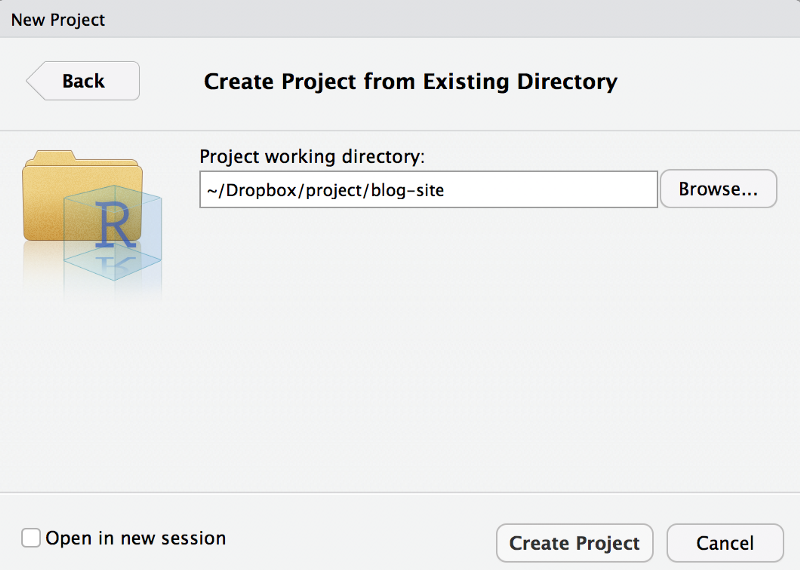
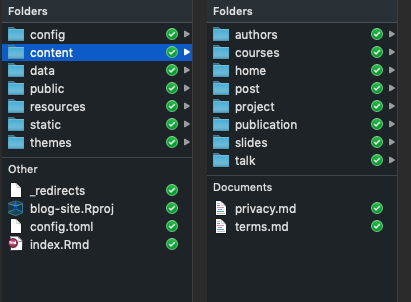
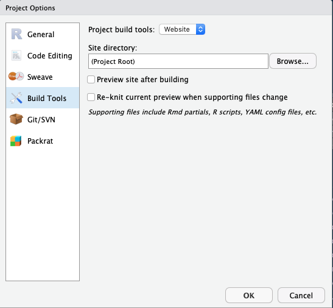
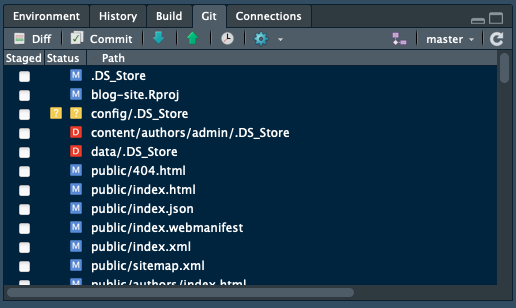
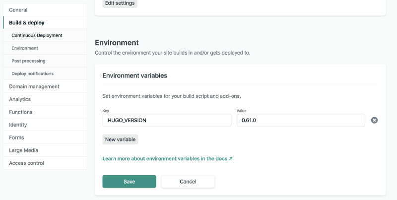
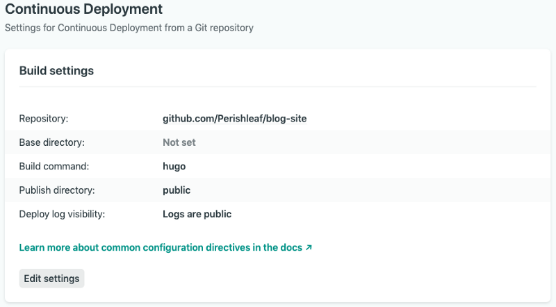
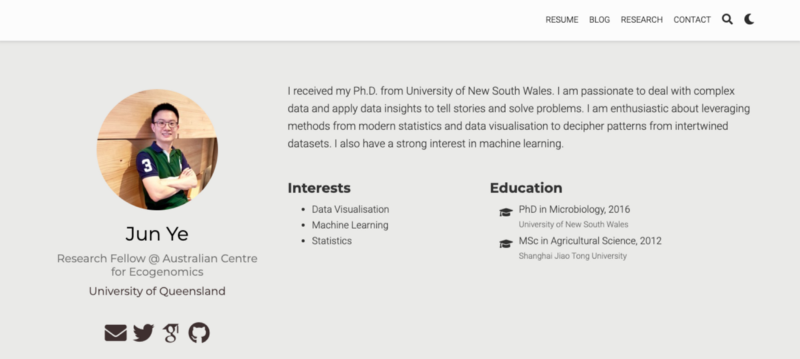

```{r setup, include=FALSE}
knitr::opts_chunk$set(collapse = TRUE)
```

I like to collect blog websites that have nice design or interesting topics. Not only does the website itself attract me, but also people who built the website. I admire them for spending time on designing their own website and publishing contents constantly. I always imagine how nice it will be if I can build a blog website for myself one day. However, I always flinched at the complex knowledge of HTML, CSS, PHP, and JavaScript. Recently, I revisited one of the blogs by [Yihui Xie](https://yihui.org/), who is an active software engineer working in RStudio and the author of many popular R packages, including the one we are going to introduce in this post, `blogdown`. I was deeply touched by one of his words, which he distilled from [Carlos Scheidegger](https://cscheid.net/).

#### | *"I web, therefore I am"*


My understanding for this phrase has two folders: 1) having your own website makes you keeping track of what you have done and thought as all contents on your website are under your own control. 2) most importantly, it largely expands the chance for people to know you. You can showcase your work to prospective employers more effectively. This is extremely helpful for people looking for [tech-related jobs](https://medium.com/r/?url=https%3A%2F%2Ftowardsdatascience.com%2Fhow-to-get-hired-as-an-entry-level-data-scientist-when-you-dont-already-have-3-years-experience-476394f2cc2c). Taken together, I think it is time to make my long-term imagination to a real thing.

In this post, I will share my notes in creating [my own website](https://junye0798.com/#resume) using `blogdown`, which is the tool built to significantly simplify the whole processes from creating a website to updating the website. This post basically comprises four parts:

**Create new repo on [Github](https://github.com/) → Build website in [RStudio](https://rstudio.com/) → Deploy website using [Netlify](https://www.netlify.com/) → Customise domain name**

### Create new repo on Github
Since [Netlify](https://www.netlify.com/) (a static website service) will automatically render your website via the github source repository, we need to first create a new repository for your github account to host all source files of your website.

After this, let's create a local version of this repository on your machine. This is called cloning. To do that, click the green "Clone or download" button in your repository site and click the copy icon to copy the repository URL (Clone with SSH) to the clipboard buffer . Then, back to the Terminal (I am using Mac), and navigate to the directory where you want the local version of the repository to reside. Run the following in Terminal:
```bash
git clone <repository_URL>
```
You should see a new folder with the name of your repository appear. So, in my case, I should see **blog-site** appear after typing `ls`. To be able to communicate with github from your machine, I assume you already configured the ssh key and add it to your GitHub account. If you never use `git` before, [here](https://medium.com/@aklson_DS/how-to-properly-setup-your-github-repository-mac-version-3a8047b899e5) is a detailed tutorial about how to set up repository and clone it.

### Build website in RStudio
Now, let's switch to RStudio (a free IDE for R). We need to install the `blogdown` package and following by `hugo` (an open-source static site generators).
```R
## Install from CRAN
install.packages("blogdown")
## Or, install from GitHub
if (!requireNamespace("devtools")) install.packages("devtools")
devtools::install_github("rstudio/blogdown")
blogdown::install_hugo()
```
Then let's create a new project in RStudio for your website. Select `File` > `New Project` > `Existing Directory`, then browse to directory where the GitHub repository is and click on the **Create Project** button.

RStudio will open a new session with this newly created project. We now need to edit the `.gitignore file`. You can find it from the file viewer panel in RStudio (normally locates at lower-right panel, `Files` tab). Click the file to open it in RStudio and edit the content as follow:
```R
.Rproj.user
.Rhistory
.RData
.Ruserdata
blogdown
.DS_Store # if a windows user. Thumbs.db instead
public/ # if using Netlify
```
With everything set, we can literally start to build our website using `blogdown::new_site()` function (just simply type this in R console). However, as suggest in the detailed instruction [here](https://bookdown.org/yihui/blogdown/workflow.html), we'd better to decide a theme right now instead of later. Moreover, we'd better start from a simple theme instead of complex one, especially when you don't familiar with HTML, CSS, or JavaScript, and have no experience with Hugo themes or templates. I selected [Academic](https://themes.gohugo.io/academic/) theme as it is under active maintenance and very agile to tailor. Just type:
```R
blogdown::new_site(theme = "gcushen/hugo-academic", theme_example = TRUE)
```
You will find the example website showed up in `Viewer` tab in RStudio and several folders will be created automatically in the **blog-site** folder. These are all files for the website to run.

Next we need to update project options based on [recommendations here](https://bookdown.org/yihui/blogdown/rstudio-ide.html#fig:project-options). `Tools` > `Project Options`. Basically, uncheck the two boxes.

Now it is time to turn the sample website to be our own by editing the configurations following instructions [here](https://bookdown.org/yihui/blogdown/configuration.html). If you are using the Academic theme, a quick way to customise the sample website is to go to the folder `blog-site` > `content` > `home`, you will find many markdown files. These are configuration files for different widgets (i.e. sections displayed on the website). We can turn them off based on your own purpose by change the `active` value to `false`. It is very time-consuming to beautify website and add corresponding content to each section, to be able to make our website online now, you can leave only `about.md` as `active`, which means you only need to fill content for about page for now. We can turn other widgets on later once contents for the sections are ready.


### Deploy website using Netlify
When everything is ok for the `about` page, we can commit the changes and push the repository from your machine to GitHub, then go online to Netlify.

Select `Git` tab from RStudio, then `Commit`. From there, select all changed files and write down some messages in the `Commit message` window to keep a record, for example, "First change for about page". Then click `Commit` and `Push`. Now the repository in your GitHub is updated.

We need to sign up with Netlify to use its service for free using your GitHub account. Once logged in, and select: `New site from Git` -> `Continuous Deployment: GitHub`, from there, select the GitHub repositories with website files. Then we need to configure the build. Remember to create a new variable for the hugo version you used for creating website. Typing `hugo version` in the terminal. My hugo version is 0.61.0 and so this is what I typed.



After all these settings, Netlify will deploy the website in seconds and assign it a random subdomain name.This is the domain name for my website, `objective-wright-b68557.netlify.com`. You can change the domain name as you want, but it need to be ended with `netlify.com`. Now, we have our own website online.


### Customise domain name
You will definitely look like a geek if your domain name is "yourname.com" instead of affiliating with other domains. Hence, I went one step further by purchasing my own domain name ([junye0798.com](https://junye0798.com/)) from a DNS provider with about $20. This enables me to own the domain name for 2 years. To stay neutral, I am not going to make recommendations here for DNS provider. You will easliy find a good one. I then updated my own domain information in Netlify following its instruction [here](https://docs.netlify.com/domains-https/custom-domains/#definitions). If you want to know more about domain registration, please read this [section](https://bookdown.org/yihui/blogdown/domain-name.html) by Yihui Xie, you will be convinced to have your own domain name.

Here are some good resources I used for building your website:

* [Up & Running with blogdown](https://alison.rbind.io/post/2017-06-12-up-and-running-with-blogdown/)
* [blogdown: Creating Websites with R Markdown](https://bookdown.org/yihui/blogdown/)
* [Getting Started With the Page Builder](https://sourcethemes.com/academic/zh/docs/page-builder/#icons)

As always, I welcome feedback, constructive criticism, and hearing about your data science projects. I can be reached on [Linkedin](https://www.linkedin.com/in/jun-ye-29aaa769/), and now on my [website](https://junye0798.com/) as well.