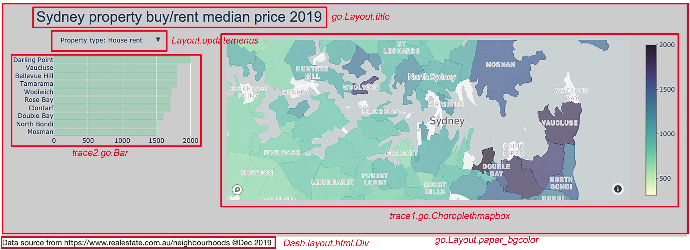

---
authors:
- admin
categories: 
- Post
date: "2019-12-23T00:00:00Z"
draft: false
featured: true
image:
  caption: ""
  focal_point: ""
  placement: 2
  preview_only: false
lastMod: "2019-12-23T00:00:00Z"
projects: []
subtitle: Visualisation of Sydney Property Median Price by Suburbs
summary: 
tags:
- Data Visualisation
- Plotly
- Dashboard
- Dash
- Python3
title: Build an Interactive Choropleth Map with Plotly and Dash
---

Last week, I finished my final assignment in IBM Data Science course, which is to find an ideal suburb for opening an Italian restaurant based on location data. During the process, I web-scrapped property median price (i.e. House buy/rent and Unit buy/rent) for each suburb in Sydney and plotted them on Choropleth maps, respectively.

However, I was wondering if it is possible to combine all these maps in one and select one of them just by clicking name from a dropdown menu. In addition, I want to add one more plot next to the map to show the top 10 suburbs with the highest median prices accordingly. These add-ons will make the map more informative and user-friendly. In this post, I will share my notes about how to create an interactive dashboard with a choropleth map and bar plot using Plotly and Dash. In addition, I assume that you have prior experience with Plotly.

### Prerequisites
Install `plotly`, `dash`, and `pandas` on the system. I created a virtual environment using conda to keep the system organised and avoid mess up with other packages in the system. I have introduced conda virtual environment in my previous [post](https://medium.com/swlh/running-python-and-r-within-jupyter-lab-from-remote-server-d9dfbc4f9a85) if you want to know more about conda env. The following code will create a virtual environment that have all required packages for `plotly` and `dash`.
```bash
conda create -n <whatever name you want for this env> -c plotly plotly=4.4.1 -c conda-forge dash pandas
```
To be able to draw a map in plotly, we also need a token from Mapbox, which provides various nice map styles and most importantly is for free. In addition, two datasets were used in this dashboard and they can be download from my [github](https://github.com/Perishleaf/data-visualisation-scripts) (← You can also find the dash app code here).

### Bullet train path

If you want to explore the dash app now, after finishing above steps, you need to assign your Mapbox token to mapbox_accesstoken in this [script](https://github.com/Perishleaf/data-visualisation-scripts/blob/master/dash_project_medium.py) and run it in the same directory with the two datasets. Once the following message popped up, just open this address http://127.0.0.1:8050/ in your preferred browser and dash will be loading in there.
```bash
$ python dash_project_medium.py
  Running on http://127.0.0.1:8050/
  Debugger PIN: 880-084-162
  * Serving Flask app "dash_project" (lazy loading)
  * Environment: production
    WARNING: This is a development server. Do not use it in a production deployment.
  Use a production WSGI server instead.
  * Debug mode: on
```
### Steaming train path
As shown in the following figure, I have labelled the key functions used in the script for creating corresponding elements in the dashboard.

The general principle in building this dashboard via `plotly` and `dash` is to 1) arrange and combine different elements together on a defined canvas; 2) compile all elements in one container:```fig=go.Figure(data=trace2 + trace1, layout=layout)```; 3) pass this container to `dcc.Graph`, in which `dcc` is the dash core components, and dash will create a html-based web application for the dashboard.

A key function of this dashboard is to show a specific parameter (i.e. `House_buy`, `House_rent`, `Unit_buy` and `Unit_rent`) in the two traces (choropleth map and bar plot) via the dropdown menu. My method is to create four layers with an argument `visible=False` for each trace. Then use the buttons feature of `updatemenus` to turn `visible=True` for a given parameter.
```python
# Create bar plot for trace2
trace2 = []
for q in Types:
    trace2.append(go.Bar(
        x=median_price_new.sort_values([q], ascending=False).head(10)[q],
        y=median_price_new.sort_values([q], ascending=False).head(10)['Suburb_name_geojson'].str.title().tolist(),
        xaxis='x2',
        yaxis='y2',
        marker=dict(
            color='rgba(91, 207, 135, 0.3)',
            line=dict(
                color='rgba(91, 207, 135, 2.0)',
                width=0.5),
        ),
        visible=False,
        name='Top 10 suburbs with the highest {} median price'.format(q),
        orientation='h',
    ))
    
trace2[0]['visible'] = True
```
Thus, there are four figure layers in each trace and only one is visible depends on which button is clicked in a given time point.
```python
# add a dropdown menu in the layout
layout.update(updatemenus=list([
    dict(x=0,
         y=1,
         xanchor='left',
         yanchor='middle',
         buttons=list([
             dict(
                 args=['visible', [True, False, False, False]],
                 label='Property type: Unit buy/M',
                 method='restyle'
                 ),
             dict(
                 args=['visible', [False, True, False, False]],
                 label='Property type: Unit rent',
                 method='restyle'
                 ),
             dict(
                 args=['visible', [False, False, True, False]],
                 label='Property type: House rent',
                 method='restyle'
                 ),
             dict(
                 args=['visible', [False, False, False, True]],
                 label='Property type: House buy/M',
                 method='restyle'
                )
            ]),
        )]))
```
Since map are not plotted on a cartesian system of coordinates (x/y), which is the coordinates system used in the bar plot, I set up two coordinates systems in the dashboard for the map and bar plot, respectively. As for the bar plot(`trace2`), its axes are assigned to `xaxis='x2'`, `yaxis='y2'`. Instead, the map (`trace1`) has its own features within `Layout`, which was assigned to the variable `mapbox1`, the numbers following `mapbox` and `x/y` is arbitrary. Having said this, you can assign as many coordinates systems as you want, just make sure you anchor the right system to its trace in the Layout.
```python
# Suburbs order should be the same as "id" passed to location
for q in Types:
    trace1.append(go.Choroplethmapbox(
        geojson = Sydney_data,
        locations = median_price_new['id'].tolist(),
        z = median_price_new[q].tolist(), 
        colorscale = pl_deep,
        text = suburbs, 
        colorbar = dict(thickness=20, ticklen=3),
        marker_line_width=0, marker_opacity=0.7,
        visible=False,
        subplot='mapbox1',
        hovertemplate = "<b>%{text}</b><br><br>" +
                        "Price: %{z}<br>" +
                        "<extra></extra>")) # "<extra></extra>" means we don't display the info in the secondary box, such as trace id.
```
Then within the `Layout` settings, we do adjustments for these two coordinates systems individually. Such as the position of traces in the dashboard via `domain`, the appearance of ticks on each axis via `showticklabels`, and the ascending order of bar via `autorange`.
```python
layout = go.Layout(
    title = {'text': 'Sydney property buy/rent median price 2019',
       'font': {'size':28, 
           'family':'Arial'}},
    autosize = True,
    
    mapbox1 = dict(
        domain = {'x': [0.3, 1],'y': [0, 1]},
        center = dict(lat=latitude, lon=longitude),
        accesstoken = mapbox_accesstoken, 
        zoom = 12),
    xaxis2={
        'zeroline': False,
        "showline": False,
        "showticklabels":True,
        'showgrid':True,
        'domain': [0, 0.25],
        'side': 'left',
        'anchor': 'x2',
    },
    yaxis2={
        'domain': [0.4, 0.9],
        'anchor': 'y2',
        'autorange': 'reversed',
    },
    margin=dict(l=100, r=20, t=70, b=70),
    paper_bgcolor='rgb(204, 204, 204)',
    plot_bgcolor='rgb(204, 204, 204)',
)
```
After concatenating all elements within `fig=go.Figure`, I assigned `fig` to `dcc.Graph`, wrapped up all codes as a `py` file, and run it. Boom, here comes my first interactive dashboard.
```python
external_stylesheets = ['https://codepen.io/chriddyp/pen/bWLwgP.css']
app = dash.Dash(__name__, external_stylesheets=external_stylesheets)
app.layout = html.Div(children=[
    html.H1(children=''),
dcc.Graph(
        id='example-graph-1',
        figure=fig
    ),
html.Div(children='''
        Data source from https://www.realestate.com.au/neighbourhoods @Dec 2019
    ''')
])
if __name__ == '__main__':
    app.run_server(debug=True)
```
I should note that I only used very basic Dash structure here, most of the codes are still written in Plotly. One drawback of my method is that stacking all four layers onto the same trace may slow down the app, this is because all data need to be loaded when the dash app is initialising. It will be more efficient to do real-time updating when a clicking dropdown menu event happened. Hopefully, further learning with advanced Dash code will find me a solution.

Here are some resources for learning Dash:
* [Dash User Guide](https://dash.plot.ly/)
* [Dash for beginners from Datacamp](https://www.datacamp.com/community/tutorials/learn-build-dash-python)
* [Dash Community Forum](https://community.plot.ly/c/dash)
* [Awesome Dash Resource Guide on Github](https://github.com/ucg8j/awesome-dash)
* [A detailed Dashboard building post](https://towardsdatascience.com/how-to-build-a-complex-reporting-dashboard-using-dash-and-plotl-4f4257c18a7f)

As always, I welcome feedback, constructive criticism, and hearing about your data science projects. I can be reached on [Linkedin](https://www.linkedin.com/in/jun-ye-29aaa769/).
