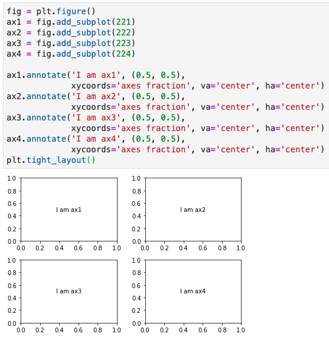
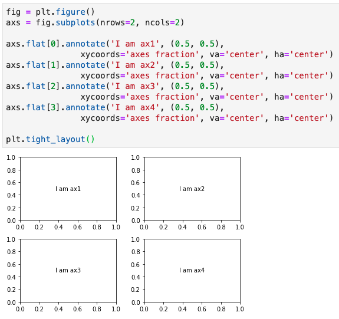
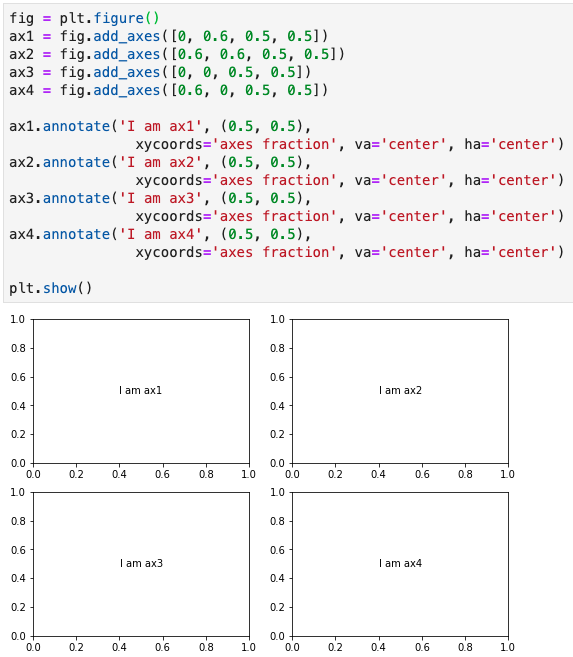

Although `matplotlib` is extremely powerful and the only limitation might be our imagination, it is a bit challenging for new users to find the right path as there are always more than one way to achieve the same goal in `matplotlib`. Calling `axes` is one of them.

Let's say you just decide to make plots using **object-oriented interface** ([*aka artist layer plotting*](https://towardsdatascience.com/plt-xxx-or-ax-xxx-that-is-the-question-in-matplotlib-8580acf42f44)) in `matplotlib`. However, I bet you will be soon running into problems when trying to instantiate `axes` to start your plotting. You may find that `plt.subplots()` and `plt.subplot()` both can return you `axes`. Yes, they only differ by one letter 's'. Later, you notice that `plt.axes()` can call `axes` as well. It is not over yet, you highly likely will encounter the following functions `fig.add_subplot()`, `fig.add_axes()`, and `fig.subplots()`, which are all able to create `axes` for you. I totally understand how panic you are or will be as I have had the same confusion in learning `matplotlib`.

In this post, I will summarise the differences of these functions (i.e. `plt.subplot()`, `plt.subplots()`, `plt.axes()`, `fig.add_subplot()`, `fig.subplots()`, and `fig.add_axes()`) and demonstrate how to use them accordingly.

---

In `matplotlib` terminology, a basic plot starts from one `figure` and at least one `axes` (if you are confused about these terms, you may find [this post](https://towardsdatascience.com/plt-xxx-or-ax-xxx-that-is-the-question-in-matplotlib-8580acf42f44) is useful). A close analogy with painting, `figure` is the canvas and `axes` is the artistic composition. A canvas (`figure`) can have only one type or many different types of artistic composition (`axes`) on it. In light of this, let's first start from a simple case for `figure` with only one `axes`, then dive into `figure` with multiple `axes`.

### `figure` with only one `axes`
In most circumstances, we instantiate a `fig` object by calling `fig = plt.figure(…)` and then add an `axes` object to the `fig` by calling `ax = fig.add_subplot()`. By default, if leave the parentheses empty, this function is passed with `fig.add_subplot(1, 1, 1)`, which means add # 1 `axes` in a 1 row by 1 column `axes` grid. We can also use an alternative format with 3-digit integer without comma (i.e. `fig.add_subplot(111)`). However, with the 3-digit integer format,  each integer cannot be greater than 9. Using this function, we add only one `axes` at a time.

```python
# Create a figure
fig = plt.figure()
# Add a subplot
ax = fig.add_subplot()

# Equivalent method
ax = fig.add_subplot(111)
# Another equivalent but more general method
ax = fig.add_subplot(1, 1, 1)
```

Sometimes, we are able to add an `axes` object using `ax = fig.subplots()`. This function is originally devised to make it convenient to create a set of subplots in common layouts by a single call. It takes `nrows` and `ncols` as positional arguments (i.e. this function is supposed to add multiple `axes` at a time). However, if we leave the parentheses empty, this function is passed with `fig.subplots(1, 1)` by default, which means create an `axes` grid with 1 row by 1 column (i.e. one `axes` on `fig`). Hence the axes only contain one item in it (i.e. `len(ax)` is 1).

```python
# Create a figure
fig = plt.figure()

# Create a subplot
ax = fig.subplots()
# Equivalent method
ax = fig.subplots(1, 1)
```

Rarely, as for `figure` with one plot, we may also use `ax = fig.add_axes([left, bottom, width, height])` to add an `axes` onto a `fig`. This function enables **arbitrary layouts** of `axes` on `fig` by taking the dimensions (`[left, bottom, width, height]`) of the new `axes` (you can find an example [here](https://towardsdatascience.com/plt-xxx-or-ax-xxx-that-is-the-question-in-matplotlib-8580acf42f44)). All four numbers should be in fractions of `figure` width and height. In other words, we control the position and size of the `axes`. `fig.add_axes([0, 0, 0.78, 0.78])` creates the same size plot as by `fig.add_subplot(111)` and `fig.subplots(1, 1)`. As you can see here, `axes` is not in the same size as `figure`. There is white space between `axes` and `figure` by default.

```python
# Create a figure
fig = plt.figure()
# Add a subplot 
ax = fig.add_axes([0, 0, 0.78, 0.78])
```

After demonstrating the differences of the above three functions, it is fairly easy to understand `plt.subplot()`, `plt.subplots()`, and `plt.axes()`. They are from **state-based interface** (aka scripting layer plotting) of `matplotlib`, which just wrapped `fig = plt.figure()` with `fig.add_subplot()`, `fig.subplots()`, and `fig.add_axes()`, correspondingly.

`plt.subplot()` returns only one `axes` and create a `figure` object automatically. You can change `figure`-level attributes or save the `figure` by calling `ax.figure.xxx()` instead. For example, `ax.figure.savefig('example.png')` will save the figure as `example.png`.

```python
# Creates just a figure and only one subplot
ax = plt.subplot()
# Equivalent method
fig = plt.figure()
ax = fig.add_subplot(1, 1, 1)
```
`plt.subplots()` returns a tuple containing a `figure` and `axes` object(s). We need to unpack this tuple and assign its items to variables `fig` and `ax`, respectively.

```python
# Creates just a figure and only one subplot
fig, ax = plt.subplots()
# Equivalent method
fig = plt.figure()
ax = fig.subplots(1, 1)
```

`plt.axes()` returns one `axes` using `fig.add_subplot(1, 1, 1)` when no argument is provided and, just like `plt.subplot()`, it creates a `figure` object automatically. `plt.axes()` also accept dimensions (`[left, bottom, width, height]`) using `fig.add_axes([left, bottom, width, height])` in its backend. The following two sets of code create the same plots.

```python
# Set one
# Creates just a figure and only one subplot
ax = plt.axes()
# Equivalent method
fig = plt.figure()
ax = fig.add_subplot(1, 1, 1)
-------------------------------------------
# Set two
# Creates just a figure and only one subplot
ax = plt.axes([0, 0, 0.78, 0.78])
# Equivalent method
fig = plt.figure()
ax = fig.add_axes([0, 0, 0.78, 0.78])
```

### `figure` with multiple `axes`
When it comes to plotting multiple `axes` on `figure`, the differences among these functions (i.e. `plt.subplot()`, `plt.subplots()`, `plt.axes()`, `fig.add_subplot()`, `fig.subplots()`, and `fig.add_axes()`) become manifest. Again, let's demonstrate this using examples. Since `plt.subplot()`, `plt.subplots()`, and `plt.axes()` are essentially the same as `fig.add_subplot()`, `fig.subplots()`, and `fig.add_axes()`, I will only show examples for the later three functions.

As stated above, we add one `axes` at a time when using `fig.add_subplot()`. The build-in order of `axes` is started from left to right and from top to bottom within the `axes` grid (Figure 1).


The same layout could be obtained using `fig.subplots()` with one line of code (Figure 2). It returns a `ndarray` object `axs` (I add a 's' after `ax` to show that it contains multiple objects). Just like an 2D array object, each `ax` within `axs` can be accessed using `axs[x, y]` as well (i.e. `ax1` can be accessed using `axs[0, 0]`). Moreover, if you like to assign names to each `ax` within `axs`, you can use tuple unpacking like this, `((ax1, ax2), (ax3, ax4)) = fig.subplots(nrows=2, ncols=2)`. Flattening of 2D array is another method to access `ax` from `axs` as shown in Figure 2.


Normally, `fig.add_axes()` is used for arbitrary layout, such as a plot with inlet subplots or subplots overlap with each other. This is because we can fine-tune the position and size of each subplot by its dimensions (`[left, bottom, width, height]`). Having said that, we still can make a common layout as shown in Figure 1 and 2 using `fig.add_axes()` (Figure 3).


In summary, these six functions (concisely should be three functions, i.e. `fig.add_subplot()`, `fig.subplots()`, and `fig.add_axes()`) can be used interchangeably when you are making a `figure` with only one `axes`. However, they have respective strengths and can be used individually or in combination when it comes to making `figure` with multiple `axes` in different layouts.

After reading this post, I hope you have a clearer understanding about how to call `axes` in `matplotlib`. All the codes in this post can be accessed from [jupyter notebook](https://github.com/Perishleaf/data-visualisation-scripts/blob/master/matplotlib_init_fig_ax/matplotlib_init_fig_ax.ipynb). If you know other functions/cases to call `axes` which are not listed here, please feel free to leave your comment. Let's learn matplotlib together.

---

As always, I welcome feedback, constructive criticism, and hearing about your data science projects. I can be reached on [Linkedin](https://www.linkedin.com/in/jun-ye-29aaa769/), and now on my [website](https://junye0798.com/) as well.