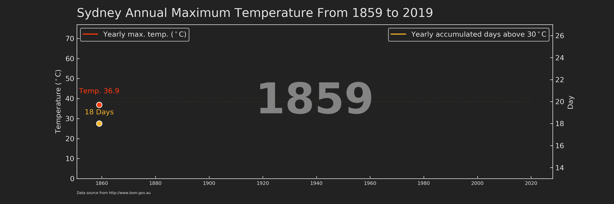
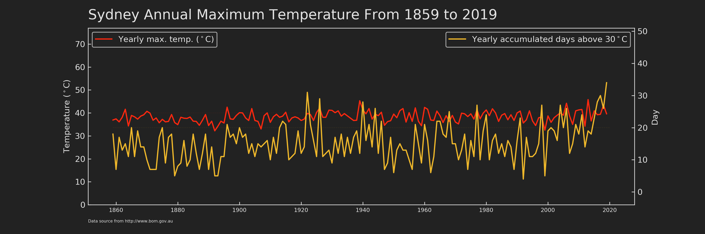
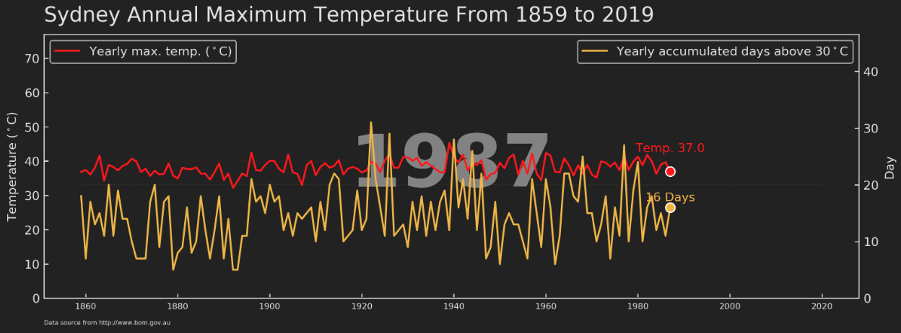

I believe one of the main current events you have read about must be [the Australian Bushfire Crisis](https://www.google.com/search?q=australian+bushfire&rlz=1C5CHFA_enAU739AU739&oq=australian+bushfire&aqs=chrome..69i57j35i39l2j0l4j69i64.3751j1j9&sourceid=chrome&ie=UTF-8). The devastating disaster has affected more than 10 million hectares of land, which is compatible to the land area of Portugal, and an estimated 1 billion wild mammals, birds and reptiles have been killed (Source [here](https://www.nature.com/articles/d41586-020-00043-2)). Increasing evidence has shown the links between climate change/global warming and this year’s bushfire, such as extreme temperature (1.5ºC above average) and prolonged drought (Source [here](https://www.theguardian.com/australia-news/2020/jan/02/2019-australia-hottest-year-record-temperature-15c-above-average-temperature)). Reading these numbers in isolation, you may not see how climate change has evolved over time. From a perspective of data visualisation, instead of using a single value to describe the changing scale, it may be more appealing and informative to use a time series graph, which can show the dynamic trend of a variable along a large scale of time period. I, therefore, took this chance to practice `ax.xxx()` method in matplotlib using Sydney's long-term temperature data. If you want to know what is `ax.xxx()` method in matplotlib, please take a look at [my last post](https://towardsdatascience.com/plt-xxx-or-ax-xxx-that-is-the-question-in-matplotlib-8580acf42f44). It will help you to understand this post and further to learn matplotlib.

In this post, I will show you how I made the animated time series graph (as shown at the beginning of this post) of annual maximum temperature across a 160-year period in Sydney. Before we dive into the code, here are some takeaways from this plot:

1. The number of years that have annual maximum temperature above 40ºC increased from 13% to 30% before and after 1920.
2. The highest daily maximum temperature ever recorded in Sydney was 45.8ºC in 2013.
3. The chances to experience a long period of hot days (defined as the total number of days that have maximum daily temperature above 30ºC within a given year) are 12% and 24% before and after 1920, respectively.
4. In 2019, we have experienced the highest number of hot days (34 days) compared to all other recorded years.

---

#### Structure and theme of the plot

As a standalone figure (Figure 1), it should contain at least three parts, i.e. title, plot, and footnote. It’s easy to understand the first two parts. As for the footnote, it is usually used to indicate the data source of this figure and special notes.

The plot is no doubt the most important part of the whole figure. In this case, I used two different y-axes to show temperature and day individually and they shared the same x-axis, which is year. matplotlib provides an easy way to create twin axes: `ax.twinx()`/`ax.twiny()`. Specifically, `ax.twinx()` creates a new `axes` that shares the x-axis with `ax`, but can have a different y-axis. Likewise, `ax.twiny()` returns an axes sharing the y-axis, but with a different x-axis. After constructing the figure framework, I set up a futuristic colour theme, which inspired from [Tron Legancy](https://d23.com/a-to-z/tron-legacy-film/). In `matplotlib`, we can easily configure the figure style via `plt.rc()`. `rc` stands for **C**onfigure file that automatically **R**un at startup.

```python
# set up plot style as tron legancy
from matplotlib import cycler
colors = cycler('color',
                ['#fc280f', '#5fdcff', '#f4ba26', '#85c54c', '#c6d7e0']) # colors for artists will be cycled from this list by default
plt.rc('figure', facecolor='#222222') # facecolor is background colour
plt.rc('axes', facecolor='#222222', edgecolor='#222222',
       axisbelow=True, grid=True, prop_cycle=colors) # "axisbelow" set axis ticks and gridlines are below all artists
plt.rc('grid', color='#e3e3e3', linestyle='solid')
plt.rc('xtick', direction='in', color='#e3e3e3')
plt.rc('ytick', direction='in', color='#e3e3e3')
plt.rc('patch', edgecolor='#e3e3e3')
plt.rc('lines', linewidth=1.5)
```

#### Create a function for static plotting

Let’s take a look at the lite function for creating an animated plot in `matplotlib`.
```python
animation.FuncAnimation(fig, func, frames=None)
```
Essentially, animated `fig` is just a collection of static `axes` obtained by `func` with different values (`frames`). It very much just like the [flipbook animation](https://en.wikipedia.org/wiki/Flip_book). In my case, there are in total 160 frames of `axes` (from year 1859 to 2019, i.e. `range(1859, 2020, 1)`). With this sorted out, I then created a function that could be applied generally to different `year` values.

```python
def draw_linechart(Num_Year):
    ''' 
    This is the function to make a plot
    '''
    # since many figures will be generated for animation, old axes need to be cleared before drawing new axes
    ax.clear() 
    ax2.clear()
    
    # select data till the indicated year
    df_tmp=df_sydney.loc[df_sydney['Year'] <= Num_Year] 
    
    # The frame of the whole figure, use the full data
    # excluding from the automatic legend element selection by 
    # defining a label starting with an underscore.
    ax.plot(df_sydney.Year, df_sydney.max_tmp_year*0, label='_1', color='#222222', zorder=1)
    
    # The horizontal line to indicate 40 degree, use the full data
    ax.plot(df_sydney.Year, (df_sydney.max_tmp_year**0)*40, label='_1', color='#fc280f', linestyle='dashed', alpha=0.1, linewidth=0.5, zorder=1)

    # The horizontal line to indicate 20 days, use the full data
    ax2.plot(df_sydney.Year, (df_sydney.hot_day**0)*20, label='_2', color='#eeb72b', linestyle='dashed', alpha=0.1, linewidth=0.5, zorder=1)

    # line plot
    ax.plot(df_tmp.Year, df_tmp.max_tmp_year, label='Yearly max. temp. ($^\circ$C)', 
            color='#fc280f', zorder=3)
    ax2.plot(df_tmp.Year, df_tmp.hot_day, label='Yearly accumulated days above 30$^\circ$C', 
             color='#eeb72b', zorder=3)

    # dot at the end of the line
    ax.scatter(df_tmp.Year.values[-1], df_tmp.max_tmp_year.values[-1], color='#fc280f', s=60, edgecolor ='w', linewidth=1, zorder=4)
    ax2.scatter(df_tmp.Year.values[-1], df_tmp.hot_day.values[-1], color='#eeb72b', s=60, edgecolor ='w', linewidth=1, zorder=4)

    # text associated with the dot in the figure
    ax.text(df_tmp.Year.values[-1], df_tmp.max_tmp_year.values[-1]+5,
            s='Temp. {}'.format(df_tmp.max_tmp_year.values[-1]), size=10, 
            color='#fc280f', ha='center', va='bottom', zorder=5)
    ax2.text(df_tmp.Year.values[-1], df_tmp.hot_day.values[-1]+0.7, 
             s='{} Days'.format(int(df_tmp.hot_day.values[-1])), size=10, 
             color='#eeb72b', ha='center', va='bottom', zorder=5)

    # display year in the background
    ax.text(0.5, 0.5, s=df_tmp.Year.values[-1], fontweight='bold', size=60, 
            color='#e3e3e3', ha='center', va="center", 
            alpha=0.5, transform=ax.transAxes, zorder=2)

    # legend for red line
    l1 = ax.legend(loc='upper left')
    
    for text in l1.get_texts():
        text.set_color('#e3e3e3')
    
    # legend for yellow line
    l2 = ax2.legend(loc='upper right')
    
    for text in l2.get_texts():
        text.set_color('#e3e3e3')
    
    # set the y-axis to have enough space for other elements, such as legends
    ax.set_ylim(0, df_sydney.max_tmp_year.max()*1.68)
    # do not show the grid in the background
    ax.grid(b=None)
    ax.set_ylabel('Temperature ($^\circ$C)', color='#e3e3e3')
    
    ax2.grid(b=None) # Don't show grid of ax2 
    ax2.set_ylim(df_tmp.hot_day.min()-5, df_tmp.hot_day.max()*1.5)
    ax2.set_ylabel('Day', color='#e3e3e3')
    
    # set color for axes frame
    ax2.spines['bottom'].set_color('#e3e3e3')  
    ax2.spines['right'].set_color('#e3e3e3')  
    ax2.spines['left'].set_color('#e3e3e3')  
    ax2.spines['top'].set_color('#e3e3e3') 

    # Retrieve an element of a plot and set properties
    for tick in ax.xaxis.get_ticklabels():
        tick.set_fontsize('x-small')

    ax.margins(x=0.05)

    ax.text(0.00, 1.05, 'Sydney Annual Maximum Temperature From 1859 to 2019', color='#e3e3e3', 
             transform=ax.transAxes, size=17, weight='light', ha='left')
    ax.text(0.00, -0.1, 'Data source from http://www.bom.gov.au', color='#e3e3e3', 
             transform=ax.transAxes, size=5, weight='light', ha='left')
```
  
The principle of this function is to draw elements layer by layer (or I may say it is the principle in `matplotlib` plotting). Let me explain the above function section by section.

* `ax.clear()` and `ax2.clear()`, the previous axes should be erased before plotting a new one, otherwise, old content in `axes` will be still left on the `fig` and recorded in the animation. This is also why I did not include `fig, ax = plt.subplots(figsize=(12,4), dpi=300)` and `ax2 = ax.twinx()` in the function body, but called them separately before `animation.FuncAnimation()`. The plotting space (i.e. `fig`, `ax`, and `ax2`) only need to be set once, just like a reusable whiteboard.
* `df_tmp=df_sydney.loc[df_sydney[‘Year’] <= Num_Year]`, the input for plotting should be data. The new axes should contain data of current year and all its previous year (i.e. `<=`). Therefore, when `animation.FuncAnimation` call the `draw_linechart` using `Num_Year` in any given year, the lines in the static figure should span from the beginning (i.e. year 1859) to the called year (Figure 2).

* `ax.plot(df_sydney.Year, df_sydney.max_tmp_year*0, label=’_1', color=’#222222', zorder=1)`, this is the first line plot. Notice that the data used here is not `df_tmp` but full dataframe `df_sydney`. This section is to create a frame spanned from the beginning year (1859) to the end year (2020) for each `axes` of `df_tmp`. This ensures the x-axis of each `axes` has the same year range (i.e. 1860–2020) instead of changing along with the year range of `df_tmp` (i.e. 1860-`Num_Year`). In addition, I only need the frame and the line should be hid for this layer so that I timed 0 for each value (`df_sydney.max_tmp_year`) in y-axis. You may notice that the value assigned to label contains an underscore, this is to exclude this layer from being displayed by the automatic legend element selection later (`ax.legend()`). Another argument used here is `zorder`, which can be considered as the layer sequence along z-axis and 1 means the bottom layer.

* From `ax.plot()` to `ax2.plot()`, these add two horizontal lines to make it easy for audience to estimate the value of maximum temperature and accumulated days each year.

* From `ax.plot()` to `ax.text()` this is the part for drawing most elements (lines, head dot, text running with head dot) in the `fig`. It is very straightforward to understand. The only thing I want to highlight again here is the power of `ax.xxx()`, which made the manipulations of each `axes` easy enough.

After setting up the `draw_linechart` function, let’s draw a static graph by input a specific year. If everything goes right, you will see Figure 2.

```python
# run one frame to test the function
fig, ax = plt.subplots(figsize=(12,4), dpi=300)
ax2 = ax.twinx()
draw_linechart(1987)
```
#### Wrap-up for animated graph
Running the following code will generate all frames and assign them to the object `animator`. Then this object can be saved as whatever format you want by `animator.save()`. My personal preference is to save as `mp4`. The last note is that `fig` background colour should be specified using `savefig_kwargs={‘facecolor’:’#222222'}`, otherwise it will be saved as white which is not consistent with the `Tron legancy` theme.

```python
import matplotlib.animation as animation
fig, ax = plt.subplots(figsize=(12,4), dpi=300)
ax2 = ax.twinx()
animator = animation.FuncAnimation(fig, draw_linechart, 
                                   frames=np.arange(df_sydney.Year.values.min(),df_sydney.Year.values.max(),1), interval=300)
animator.save('./animation5.mp4', savefig_kwargs={'facecolor':'#222222'})
```

Here, I demonstrated, from design to code, how to create an animated graph using `matplotlib`, which helped us to better understand the temperature change across 160 years in Sydney. You can download the data, animation, graphs, and jupyter notebook from my [Github](https://github.com/Perishleaf/data-visualisation-scripts/tree/master/matplotlib_sydney_temp).

---

As always, I welcome feedback, constructive criticism, and hearing about your data science projects. I can be reached on [Linkedin](https://www.linkedin.com/in/jun-ye-29aaa769/), and now on my [website](https://junye0798.com/) as well.
